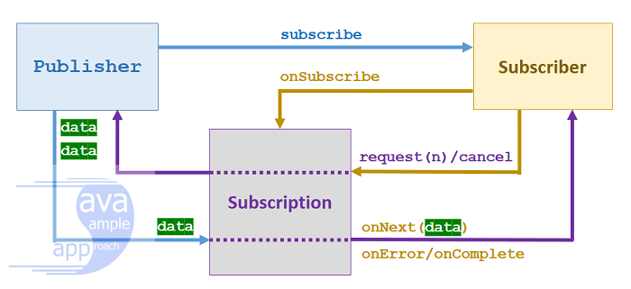
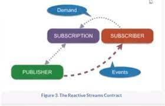

### Spring WebFlux Series - 1

이번 장에서는 Spring의 WebFlux를 알아보기 위한 선수 지식인 자바의 Observer 패턴과 Pub, Sub 구조에 대해서 알아본다.
모든 코드는 [깃허브 (링크)](https://github.com/roy-zz/webflux)의 테스트 코드에 있으므로 필요하다면 참고하도록 한다.

### Reactive Programming

**Reactive**의 의미는 외부에서 어떠한 이벤트가 발생하였을 때 대응하는 것을 의미한다.
당연한 이야기이지만 **Reactive Programming**이란 **Reactive**한 방식으로 프로그래밍하는 것을 의미한다.  

### Duality(쌍대성)

> 쌍대성(雙對性; duality)은 수학과 물리학에서 자주 등장하는 표현이다. 
> 보통 어떤 수학적 구조의 쌍대(雙對; dual)란 그 구조를 '뒤집어서' 구성한 것을 말하는데, 엄밀한 정의는 세부 분야와 대상에 따라 각각 다르다.
<center>출처: 위키백과</center>

자바의 Iterable과 Observable은 서로 쌍대성이다. 쌍대성은 쉽게 궁극적인 기능은 동일하지만 반대로 표현한 것을 의미한다.
자바 코드에서 메서드를 선언으로 예를 들면 Data method() < -- > void method(Data)와 같이 입출력은 다르지만 동일한 역할을 하는 것을 의미한다.
어떠한 이유에서 이러한 정의가 내려졌는지 하나씩 알아보도록 한다.

---

#### Iterable

Iterable은 직접 Pull하여 가져오는 방식이다.
클라이언트는 Iterable 객체로부터 필요할 때 직접 hasNext(), next()와 같은 메서드를 Pulling하여 사용한다.   

우리는 아래와 같은 방식으로 List를 선언할 수 있다.
```java
List<Integer> numbers = List.of(1, 2, 3, 4, 5);
```

여기서 List를 Iterable로 변경하여도 컴파일 오류없이 코드는 실행된다.

```java
Iterable<Integer> numbers = List.of(1, 2, 3, 4, 5);
```

이것은 List는 Collection을 상속받고 있으며 Collection이 Iterable을 상속받고 있기 때문이다.
우리는 SOLID에서 LSP(리스코프 치환법칙)을 공부하였다. 
객체(여기서 Iterable)는 하위 타입(여기서 Iterable의 손자인 List)으로 변경하여도 문제없이 작동해야하기 때문에 List는 Iterable로 변경되어도 문제없이 동작해야한다.

```java
public interface List<E> extends Collection<E> {
    // 중간 생략
}

public interface Collection<E> extends Iterable<E> {
    // 중간 생략
}
```

Iterable 인터페이스를 살펴보면 자신을 구현한 객체는 for-each 루프를 사용할 수 있다고 작성되어있다.

```java

/**
 * Implementing this interface allows an object to be the target of the enhanced
 * {@code for} statement (sometimes called the "for-each loop" statement).
 */
public interface Iterable<T> {
    // 중간 생략
}
```

최상위 인터페이스인 Iterable에서 for-each를 지원하기 때문에 하위 객체들은 전부 for-each 문법을 사용할 수 있다.
아래의 코드는 구현체는 다르지만 Iterable이거나 또는 상속받은 하위 객체이기 때문에 같은 결과물을 출력한다.

```java
Iterable<Integer> iterableNumbers = List.of(1, 2, 3, 4, 5);
iterableNumbers.forEach(i -> System.out.println("i = " + i));

Collection<Integer> collectionNumbers = List.of(1, 2, 3, 4, 5);
collectionNumbers.forEach(i -> System.out.println("i = " + i));

List<Integer> listNumbers = List.of(1, 2, 3, 4, 5);
listNumbers.forEach(i -> System.out.println("i = " + i));
```

Iterable이 구현하는 Iterator를 직접 익명 메서드로 구현하여 아래와 같이 사용가능하다.

```java
public class ReactiveProgramming {
    @Test
    @DisplayName("Iterable 구현")
    void implIterable() {
        Iterable<Integer> iterableNumbers = List.of(1, 2, 3, 4, 5);
        Iterable<Integer> customIterable = () ->
            new Iterator<>() {
                int i = 0;
                final static int MAX = 5;
                public boolean hasNext() {
                    return i < MAX; // PULL
                }
                public Integer next() {
                    return ++i; // PULL
                }
            };

        StringBuilder sBuilder1 = new StringBuilder();
        StringBuilder sBuilder2 = new StringBuilder();
        iterableNumbers.forEach(sBuilder1::append);
        customIterable.forEach(sBuilder2::append);

        assertEquals(sBuilder1.toString(), sBuilder2.toString());
    }
}
```

테스트 결과는 성공이며 우리가 예상한 결과가 나온 것을 확인할 수 있다.

---

#### Observer 개요

Observable의 경우 Iterable과 다르게 관찰을 당하는 대상이 자신을 관찰하는 관찰자들에게 Push하는 방식이다.
여기서 관찰자들은 직접 Pulling하지 않고 자신을 관찰하는 대상에게 Push이벤트를 받는 다는 점이 Observable과 다른 점이다.

Observable을 이해하기 위해 예시를 작성해본다.

```java
public class ReactiveProgrammingTest {
    @Test
    @DisplayName("Observer 구현")
    void implObserver() {
        Observer observer = new Observer() {
            @Override
            public void update(Observable o, Object arg) {
                System.out.println("arg = " + arg);
            }
        };
        ObservableNumber observableNumber = new ObservableNumber();
        observableNumber.addObserver(observer);
        observableNumber.run();
    }

    static class ObservableNumber extends Observable implements Runnable {
        @Override
        public void run() {
            for (int i = 1; i <= 5; i++) {
                setChanged();
                notifyObservers(i); // PUSH
            }
        }
    }
}
```

Observer는 대상을 관찰하는 관찰자가 된다.
ObservableNumber는 관찰의 대상이 되며 자신에게 변화가 생겼을 때 notifyObservers()를 사용하여 관찰자들에게 변화를 알린다(Push).
출력되는 결과를 보면 알 수 있듯이 Iterable은 자신이 필요할 때 Pull하는 방식이었고 Observable은 자신이 변화했을 때 Push하는 방식이지만 결과는 동일하다.

---

#### Observer와 다중 Thread

지금까지 우리는 Iterable과 Observer의 Duality(쌍대성)에 대해서 알아보았다.
위에서 작성한 Observer의 코드를 확인해보면 ObservableNumber의 변화를 기다리며 Thread를 점유하고 있는 것을 확인할 수 있다.
만약 다른 작업도 같이 진행되야 한다면 다른 작업들은 계속 지연되는 Blocking 현상이 발생한다.

Observer가 관찰하고 있는 기능을 Main 쓰레드가 아닌 다른 쓰레드에서 처리할 수 있도록 ExecutorService를 사용하여 새로운 쓰레드를 할당받을 수 있도록 코드를 수정해본다.

```java
public class ReactiveProgrammingTest {
    @Test
    @DisplayName("Observer 새로운 Thread 할당")
    void implObserverWithMultiThread() {
        Observer observer = new Observer() {
            @Override
            public void update(Observable o, Object arg) {
                System.out.printf("Observer Thread: %s, Arg: %s%n", Thread.currentThread().getName(), arg);
            }
        };

        ObservableNumber observableNumber = new ObservableNumber();
        observableNumber.addObserver(observer);
        ExecutorService executorService = Executors.newSingleThreadExecutor();
        System.out.println("Test Thread: " + Thread.currentThread().getName());
        executorService.execute(observableNumber);
        executorService.shutdown();
    }
}
```

출력 결과는 아래와 같으며 main 쓰레드가 아닌 다른 쓰레드에 의해 처리된 것을 확인할 수 있다.

```bash
Test Thread: main
Observer Thread: pool-1-thread-1, Arg: 1
Observer Thread: pool-1-thread-1, Arg: 2
Observer Thread: pool-1-thread-1, Arg: 3
Observer Thread: pool-1-thread-1, Arg: 4
Observer Thread: pool-1-thread-1, Arg: 5
```

Observer와 같은 Push 방식은 손쉽게 다른 쓰레드에서 작동하도록 구현이 가능하다.

---

#### Observer의 한계


1. 끝이 있는 관찰을 위해 관찰을 마무리하는 완료 메서드가 없다.
2. 예외를 처리에 대한 기능을 제공하지 않아서 사용하는 개발자가 직접 구현해야 한다.
3. 인터페이스가 아닌 클래스이기 때문에 확장에 제약이 있다.

이러한 한계를 극복하기 위해 확장된 옵저버 패턴이 나오게되었고 Reactive Programming의 하나의 주축이 된다.

---

### Reactive Streams

http://www.reactive-streams.org에 표준이 나와있으며 표준을 지킨 기술들 간에는 어느정도 호환성이 보장된다. 
이러한 표준은 넷플릭스, 피봇탈과 같은 회사들이 모여서 Reactive 기술의 통일성을 위하여 정하였다.
reactive-streams에는 [네 개의 API(링크)](http://www.reactive-streams.org/reactive-streams-1.0.3-javadoc/org/reactivestreams/package-summary.html)가 있고 [API들이 지켜야하는 명세(링크)]( https://github.com/reactive-streams/reactive-streams-jvm/blob/v1.0.3/README.md#specification)가 있다.
여기서 제시하는 모든 스펙을 준수해야지만 표준을 지켰다고 할 수 있다.



> A Publisher is a provider of a potentially unbounded number of sequenced elements, publishing them according to the demand received from its Subscriber(s).
> In response to a call to Publisher.subscribe(Subscriber) the possible invocation sequences for methods on the Subscriber are given by the following protocol:

```java
onSubscribe onNext* (onError | onComplete)?
```

> This means that onSubscribe is always signalled, followed by a possibly unbounded number of onNext signals (as requested by Subscriber) followed by an onError signal if there is a failure, 
> or an onComplete signal when no more elements are available—all as long as the Subscription is not cancelled.

코드 부분이 의미하는 것은 onSubscribe는 필수로 구현해야하며 onNext의 *은 호출하지 않아도 가능하며 몇 번이든 호출이 가능하다는 의미이다.
onError와 onComplete는 선택사항이며 둘 중 하나만 호출되어 종료되어야 한다.



1. Subscriber가 Publisher의 subscribe()메서드를 호출하여 구독을 신청한다.

2. 신청을 받은 Publisher는 Subscription을 생성하여 Subscriber의 onSubscribe() 메서드를 호출한다.
   Subscription은 Publisher와 Subscriber의 중간에서 구독이라는 정보를 가진 중개자가 되어 둘 간의 요청을 중간에서 담당한다.
   Subscription이 중간에 존재하면서 pulling 방식과 유사해보이지만 Subscription의 역할이 요청 자체를 위한 것은 아니며 둘간의 싱크를 맞추기위해 사용된다.
   예를 들어 Subscriber의 트래픽이 별로 없는 상황에서는 Publisher에게 지금 바쁘지 않으므로 데이터를 많이 보내도 처리할 수 있다고 요청(데이터를 처리할 수 있는 양)을 전달한다.
   만약 Subscriber에 트래픽이 몰려서 처리할 수 없는 상황이 되면 Subscription을 통해 Publisher에게 지금은 바쁘니까 데이터를 적게 전달해달라고 요청할 수도 있다.
   이때 사용하는 메서드가 Subscription의 request다.

    ```java
    static class MySubscription implements Subscription {
        @Override
        public void request(long n) {
        }
    }
    ```
   
    물론 Publisher와 Subscriber의 중간에 Buffer나 Cache를 사용하여 이러한 동기화 문제를 해결할 수 있다.
    하지만 Buffer 또한 Memory를 사용하는 존재이기 때문에 중간에 Subscription을 두는 것이 리소스 사용량 면에서 이점이 있다.
   
---

명세(Specification)에 나와있는 Publisher(Observer)와 Subscriber(Observable)가 지켜야하는 표준을 지키면서 직접 구현해본다.

**SyncPublisher**
```java
public class SyncPublisher implements Publisher<Integer> {
    @Override
    public void subscribe(Subscriber subscriber) {
        SyncSubscription syncSubscription = new SyncSubscription(subscriber);
        subscriber.onSubscribe(syncSubscription);
    }
}
```

**SyncSubscription**
```java
public class SyncSubscription implements Subscription {

    private final Subscriber<Integer> subscriber;

    public SyncSubscription(Subscriber<Integer> subscriber) {
        this.subscriber = subscriber;
    }

    @Override
    public void request(long n) {
        try {
            for (int i = 0; i < n; i++) {
                subscriber.onNext(i);
            }
        } catch (Throwable e) {
            subscriber.onError(e);
        }
    }

    @Override
    public void cancel() {

    }
}
```

**MySubscriber**
```java
public class SyncSubscriber implements Subscriber<Integer> {

    private Subscription subscription;
    private String name;
    private int count;

    @Override
    public void onSubscribe(Subscription subscription) {
        System.out.println("Call subscription. Thread Name: " + Thread.currentThread().getName());
        this.subscription = subscription;
        this.name = Thread.currentThread().getName();
        count = 5;
        this.subscription.request(count);
    }

    @Override
    public void onNext(Integer item) {
        System.out.println("Call onNext item: " + item + " SyncSubscriber Name: " + name);
        count--;
        if (count <= 0) {
            System.out.println("구독 종료");
            subscription.cancel();
        } else {
            System.out.println("Call subscription.request, count: " + count + " SyncSubscriber Name: " + name);
        }
    }

    @Override
    public void onError(Throwable throwable) {
        System.out.println("Call onError" + " SyncSubscriber Name: " + name);
    }

    @Override
    public void onComplete() {
        System.out.println("Call onComplete" + " SyncSubscriber Name: " + name);
    }
}
```

우리가 공부한 방식으로 호출이되는지 확인하기 위해 아래의 테스트 코드를 동작시켜본다.

```java
public class ReactiveProgrammingTest {
    @Test
    @DisplayName("Sync Publisher & Subscriber")
    void publisherAndSubscriber() {
        SyncPublisher syncPublisher = new SyncPublisher();
        SyncSubscriber syncSubscriber = new SyncSubscriber();

        System.out.println("Test Thread: " + Thread.currentThread().getName());
        syncPublisher.subscribe(syncSubscriber);
    }
}
```

출력 결과는 아래와 같다.

```bash
Test Thread: main
Call subscription. Thread Name: main
Call onNext item: 0 SyncSubscriber Name: main
Call subscription.request, count: 4 SyncSubscriber Name: main
Call onNext item: 1 SyncSubscriber Name: main
Call subscription.request, count: 3 SyncSubscriber Name: main
Call onNext item: 2 SyncSubscriber Name: main
Call subscription.request, count: 2 SyncSubscriber Name: main
Call onNext item: 3 SyncSubscriber Name: main
Call subscription.request, count: 1 SyncSubscriber Name: main
Call onNext item: 4 SyncSubscriber Name: main
구독 종료
```

모두 main 쓰레드에 의해서 작동한 것을 확인할 수 있다.

---

지금까지 Flow.Subscriber와 Flow.Publisher를 사용하여 Reactive Programming을 구현해보았다.
우리가 만든 SyncPublisher, SyncSubscriber, SyncSubscription은 모두 단일 쓰레드에서 작동하기 때문에 진정한 Reactive Programming이라고 보기어렵다.
(Reactive Streams 표준 문서에는 onNext, onError, onComplete 메소드가 Publish를 Blocking하지 않아야한다고 정해놓았다.)
다음 장에서는 우리가 만든 Sync* 파일들을 다중 쓰레드에서 작동할 수 있도록 수정해본다.

---

참고 강의:
- https://www.youtube.com/watch?v=8fenTR3KOJo&ab_channel=TobyLee

참고 문서:
- http://www.reactive-streams.org/
- http://www.reactive-streams.org/reactive-streams-1.0.3-javadoc/org/reactivestreams/package-summary.html
- https://github.com/reactive-streams/reactive-streams-jvm/blob/v1.0.3/README.md#specification
- https://docs.spring.io/spring-framework/docs/current/reference/html/web-reactive.html
- https://reactivex.io/
- https://grpc.io/
- https://bgpark.tistory.com/160
- https://gunju-ko.github.io/reactive/2018/07/18/Reactive-Streams.html