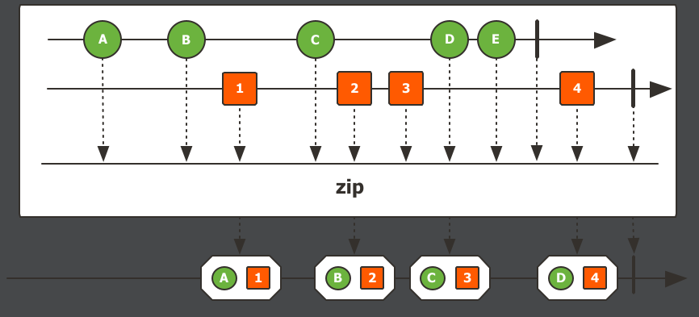

### Spring WebFlux Series - 17

[이전 장(링크)](https://imprint.tistory.com/258) 에서는 `Mono`의 동작방식과 `block()`에 대해서 간략하게 알아보았다.
이번 장에서는 `Flux` 에 대해서 자세하게 알아본다.
모든 코드는 [깃 허브 (링크)](https://github.com/roy-zz/webflux) 의 테스트 코드에 있으므로 필요하다면 참고하도록 한다.

---

### Flux

스프링 `Reactive`의 기본 인터페이스는 `Mono`가 아닌 `Flux`다.
지난 시간에는 간단하게 `String` 타입을 반환하는 방밥에 대해서만 알아보았다.  
이번 시간에는 조금 복잡한 `Object` 타입을 반환하는 시간을 가져본다.

```java
@Slf4j
@RestController
public class FluxController {
    @GetMapping("/event/v1/{id}")
    private Mono<Event> fluxVersion1(@PathVariable long id) {
        return Mono.just(new Event(id, String.format("Event %s", id)));
    }
    @Data
    @AllArgsConstructor
    public static class Event {
        long id;
        String value;
    }
}
```

`Event`라는 클래스를 생성하고 `fluxVersion1` API를 통해서 반환하도록 코드를 구현하였다.
API 응답 결과는 `JSON` 타입으로 아래와 같다.

```bash
$ curl localhost:8080/event/v1/123
{"id":123,"value":"Event 123"}  
```

만약 우리가 여러개의 `Event`를 반환하고 싶다면 `Collection`타입을 사용해야한다. 이러한 경우 `Mono`가 아닌 `Flux`를 사용해야 한다.
`Collection`과 정확하게 동일한 것은 아니고 `Stream`의 성향이 추가되어 있지만 응답되는 형태는 우리가 지금까지 사용했던 `Flux` 형태와 동일하다.

`Mono`의 `just()`는 단 하나의 파라미터만 받을 수 있지만 `Flux`의 `just`는 여러개의 파라미터를 받을 수 있다.

```java
@Slf4j
@RestController
public class FluxController {
    @GetMapping("/event/v2")
    private Flux<Event> fluxVersion2() {
        return Flux.just(new Event(1L, "Event 1"), new Event(2L, "Event 2"));
    }
    @Data
    @AllArgsConstructor
    public static class Event {
        long id;
        String value;
    }
}
```

출력되는 결과는 아래와 같으며 `Flux`를 통해서 `Collection`과 유사한 동일한 타입으로 반환된 것을 확인할 수 있다.

```bash
$ curl localhost:8080/event/v2    
[{"id":1,"value":"Event 1"},{"id":2,"value":"Event 2"}] 
```

`Mono`는 단일 값을 반환하며 `Flux`는 다중 값을 반환한다.
하지만 `Collection` 타입도 결국 단일 컬렉션 객체 안에 다중 `Object`가 들어가 있는 형태다.
아래와 같이 `Mono`를 통해 단일 `Collection` 객체를 반환해본다.

```java
@Slf4j
@RestController
public class FluxController {
    @GetMapping("/event/v3")
    private Mono<List<Event>> fluxVersion3() {
        return Mono.just(List.of(
                new Event(1L,"Event 1"),
                new Event(2L, "Event 2"))
        );
    }
    @Data
    @AllArgsConstructor
    public static class Event {
        long id;
        String value;
    }
}
```

출력되는 결과를 확인해보면 `Flux`를 통해 반환된 값이랑 동일한 것을 확인할 수 있다.

```bash
$ curl localhost:8080/event/v3
[{"id":1,"value":"Event 1"},{"id":2,"value":"Event 2"}]
```

그러면 `Mono`와 `Flux`의 차이는 무엇이 있는지 확인해본다.

아래의 `fluxVersion3` 컨트롤러와 `fluxVersion4` 컨트롤러는 같은 역할을 하는 컨트롤러다.

```java
@Slf4j
@RestController
public class FluxController {
    @GetMapping("/event/v3")
    private Mono<List<Event>> fluxVersion3() {
        List<Event> response = List.of(
                new Event(1L,"Event 1"),
                new Event(2L, "Event 2"));
        return Mono.just(response);
    }
    @GetMapping("/event/v4")
    private Flux<Event> fluxVersion4() {
        List<Event> response = List.of(
                new Event(1L,"Event 1"),
                new Event(2L, "Event 2"));
        return Flux.fromIterable(response);
    }
}
```

만약 Event 객체의 `id`값을 전부 `+1`하여 반환해야하면 코드가 어떻게 변경되는지 확인해본다.
`Flux.fromIterable(...)`의 경우 데이터 스트림을 생성하기 때문에 `map`과 같은 오퍼레이터를 사용할 수 있다.
하지만 `Mono`의 경우 `List`객체를 통으로 변환하는 것이 아니라면 `Mono`의 오퍼레이터를 통해서 `List`안의 엔티티 값을 변환하는 것을 불가능하다.

```java
@Slf4j
@RestController
public class FluxController {
    @GetMapping("/event/v3")
    private Mono<List<Event>> fluxVersion3() {
        List<Event> response = List.of(
                new Event(1L,"Event 1"),
                new Event(2L, "Event 2"));
        response = response.stream().peek(i -> i.id++).collect(Collectors.toList());
        return Mono.just(response);
    }
    @GetMapping("/event/v4")
    private Flux<Event> fluxVersion4() {
        List<Event> response = List.of(
                new Event(1L,"Event 1"),
                new Event(2L, "Event 2"));
        return Flux.fromIterable(response).map(i -> {
            i.id++;
            return i;
        });
    }
}
```

만약 `Mono`의 `map` 오퍼레이터를 통해서 엔티티의 값을 변환하려고 하면 아래와 같이 컴파일 오류가 발생하는 것을 알 수 있다.


---

### HTTP Stream

우리는 위에서 `Mono`와 `Flux`의 차이를 알아보면서 `Mono`의 경우 반환 값이 데이터 스트림 형태가 아니기 때문에 `Collection` 내부의 엔티티에 접근할 수 없지만 `Flux`의 경우 `map`을 통해 엔티티에 접근하는 방법이 가능하다는 사실을 확인하였다.
또 다른 차이는 `HTTP Stream`이라는 웹 표준을 지원하기 위해서는 `Flux`를 사용해야 편리하게 사용할 수 있다.
`HTTP Stream`은 요청을 하나 보내면 하나의 결과가 아닌 데이터를 청크 단위로 나누어 보내는 방식이다. 지금부터 `HTTP Stream`에 대해서 알아본다.

데이터를 여러개로 나누어 반환하고 싶다면 `Media-Type`을 `TEXT_EVENT_STREAM_VALUE(text/event-stream)`으로 변경해야한다.

```java
@Slf4j
@RestController
public class FluxController {
    @GetMapping(value = "/event/v6", produces = MediaType.TEXT_EVENT_STREAM_VALUE)
    private Flux<Event> fluxVersion6() {
        return Flux.just(new Event(1L, "Event 1"), new Event(2L, "Event 2"));
    }
}
```

요청에 대한 응답값은 아래와 같으며 `Collection`형태로 한 번에 반환하는 것이 아니라 엔티티 두 개가 따로 반환되고 `data`라는 키가 추가된 것을 확인할 수 있다. 

```bash
$ curl localhost:8080/event/v6
data:{"id":1,"value":"Event 1"}

data:{"id":2,"value":"Event 2"}
```
  
지금부터 `Flux`를 사용하여 일정한 시차를 두고 데이터를 반환하는 방법에 대해서 알아본다.
10개 정도의 `Event` 데이터를 `Stream.generate(...)`의 활용하여 만들어본다.
`generate(...)`은 `Supplier`를 제공하면 `Supplier`를 통해서 데이터를 생성해낸다.

```java
@Slf4j
@RestController
public class FluxController {
    @GetMapping(value = "/event/v7", produces = MediaType.TEXT_EVENT_STREAM_VALUE)
    private Flux<Event> fluxVersion7() {
        return Flux.fromStream(Stream.generate(() -> new Event(System.currentTimeMillis(), "Value")))
                .delayElements(Duration.ofSeconds(1))
                .take(10);
    }
}
```

출력되는 결과는 아래와 같다.

```bash
$ curl localhost:8080/event/v7
data:{"id":1652151355083,"value":"Value"}

data:{"id":1652151356096,"value":"Value"}

data:{"id":1652151357100,"value":"Value"}

data:{"id":1652151358109,"value":"Value"}

data:{"id":1652151359115,"value":"Value"}

data:{"id":1652151360121,"value":"Value"}

data:{"id":1652151361125,"value":"Value"}

data:{"id":1652151362133,"value":"Value"}

data:{"id":1652151363138,"value":"Value"}

data:{"id":1652151364142,"value":"Value"}
```

이번에는 `Event`를 생성할 때 `Flux`의 기능을 사용하도록 코드를 수정한다.
`sink`라는 것은 주방의 싱크대와 같이 하수를 흘려서 보낸 것처럼 데이터를 흘려서 보낸다는 의미다.

```java
@Slf4j
@RestController
public class FluxController {
    @GetMapping(value = "/event/v8", produces = MediaType.TEXT_EVENT_STREAM_VALUE)
    private Flux<Event> fluxVersion8() {
        return Flux
                .<Event> generate(sink -> sink.next(new Event(System.currentTimeMillis(), "Value")))
                .delayElements(Duration.ofSeconds(1))
                .take(10);
    }
}
```

출력되는 결과는 동일하며 `Java`의 `Stream`을 사용한 것이 아니라 순수하게 `Flux`의 기능을 사용했다는 차이만 있다.  

---

이번에는 생성되는 `Event` 객체의 `id`값을 증가시키면서 객체를 생성하도록 코드를 수정해본다.
`Flux`에서 제공하는 메서드 중에서 파라미터로 `Callable`과 `BiFunction`을 받는 `generate`를 사용하여 구현한다.

```java
@Slf4j
@RestController
public class FluxController {
    @GetMapping(value = "/event/v9", produces = MediaType.TEXT_EVENT_STREAM_VALUE)
    private Flux<Event> fluxVersion9() {
        return Flux
                .<Event, Long>generate(() -> 1L, (id, sink) -> {
                    sink.next(new Event(id, String.format("Value %s", id)));
                    return ++id;
                })
                .delayElements(Duration.ofSeconds(1))
                .take(10);
    }
}
```

출력되는 결과는 아래와 같다. 랜덤 값이 아니라 1씩 증가하는 `id`가 있는 것을 확인할 수 있다.

```bash
$ curl localhost:8080/event/v9
data:{"id":1,"value":"Value 1"}

data:{"id":2,"value":"Value 2"}

data:{"id":3,"value":"Value 3"}

data:{"id":4,"value":"Value 4"}

data:{"id":5,"value":"Value 5"}

data:{"id":6,"value":"Value 6"}

data:{"id":7,"value":"Value 7"}

data:{"id":8,"value":"Value 8"}

data:{"id":9,"value":"Value 9"}

data:{"id":10,"value":"Value 10"}
```

---

이번에는 `Flux.zip(...)`을 사용하여 데이터를 생성하는 `Flux`와 데이터 생성을 지연하는 `Flux` 두 개의 `Flux`를 만들어서 하나의 반환 값으로 만들어 본다.
`Flux.zip(...)`은 옷의 `zipper`와 같이 옷의 양쪽을 맞물리게 하는 것과 같이 두 개의 `Stream`을 합치는 역할을 한다.

```java
@Slf4j
@RestController
public class FluxController {
    @GetMapping(value = "/event/v10", produces = MediaType.TEXT_EVENT_STREAM_VALUE)
    private Flux<Event> fluxVersion10() {
        Flux<Event> events = Flux.<Event, Long>generate(() -> 1L, (id, sink) -> {
            sink.next(new Event(id, String.format("Value %s", id)));
            return ++id;
        });
        Flux<Long> interval = Flux.interval(Duration.ofSeconds(1));
        return Flux.zip(events, interval).map(Tuple2::getT1).take(10);
    }
}
```

출력되는 결과는 아래와 같으며 이전에 작동했던 결과와 동일하다.

```bash
$ curl localhost:8080/event/v10
data:{"id":1,"value":"Value 1"}

data:{"id":2,"value":"Value 2"}

data:{"id":3,"value":"Value 3"}

data:{"id":4,"value":"Value 4"}

data:{"id":5,"value":"Value 5"}

data:{"id":6,"value":"Value 6"}

data:{"id":7,"value":"Value 7"}

data:{"id":8,"value":"Value 8"}

data:{"id":9,"value":"Value 9"}

data:{"id":10,"value":"Value 10"}
```

---

### 참고

- `Object`를 반환할 때 `@RestTemplate`을 사용하면 메시지 컨버터가 `JSON` 형식으로 변환하여 반환해준다.

- `Flux`의 마블 다이어그램을 확인해보면 아래와 같다.

  

  시간의 흐름에 따라서 1번부터 데이터가 흘러가며 클라이언트에게 전달할 수 있다.

- 우리가 지금 사용해본 `fromIterable(...)`의 다이어그램을 확인해보면 아래와 같다.

  

  `fromIterable`의 경우 오퍼레이터보다는 최초에 데이터를 `Publish`하는 메소드라고 보면 된다.

- `take(...)` 는 일정 카운트가 넘어가면 데이터를 끊고 더 이상 받지 않는 오퍼레이터다.

  

- `delayElements(...)`는 `onNext(...)`를 통해 넘어오는 데이터에 지연을 주는 오퍼레이터다.

- `interval(...)`는 `subscribe`를 하면 일정 시간 간격으로 데이터를 생성하여 보내준다.

  

- `zip(...)` 두 개의 `Flux Stream`을 제공하면 `Tuple`이라는 하나의 쌍을 만들어준다.
  주로 논블록킹 외부 API를 호출하는 경우에 사용된다. 하나의 서비스에는 일정한 유저 정보를 받고 다른 하나의 서비스에서는 해당 유저의 점수를 가져올 때 데이터의 순서만 정해져있다면 데이터를 효율적으로 조합하여 반환할 수 있다.
  `Netflix`가 서버사이드에서 API를 요청하는 다이어그램을 보면 이러한 방식이 많이 사용된다.

  

---

**참고한 강의**

- https://www.youtube.com/watch?v=bc4wTgA_2Xk&t=6s&ab_channel=TobyLee