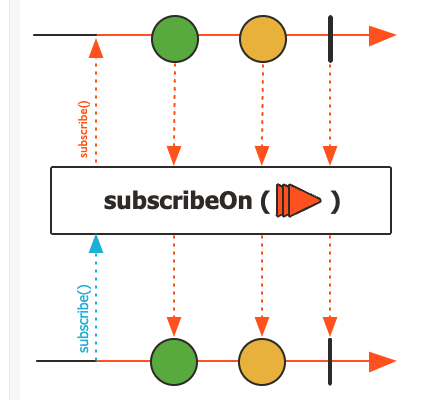
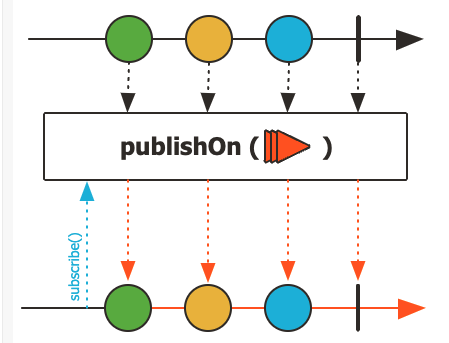

### Spring WebFlux Series - 4

[이전 장](https://imprint.tistory.com/210) 에서는 reactivestreams 패키지의 Publisher와 Subscriber를 구현하여 Operators를 만들어보았다.
이번 장에서는 Reactive Streams의 Scheduler에 대해서 알아본다.
모든 코드는 [깃허브 (링크)](https://github.com/roy-zz/webflux)의 테스트 코드에 있으므로 필요하다면 참고하도록 한다.

---

### 개요

지금까지 사용했던 방식으로 Reactive Streams의 Publisher와 Subscriber를 구현해서 테스트를 실행시켜 본다.

```java
@Slf4j
class SchedulerLectureTest {
    @Test
    void schedulerLectureTest() {
        Publisher<Integer> publisher = (subscriber) -> {
            subscriber.onSubscribe(new Subscription() {
                public void request(long n) {
                    try {
                        Stream.iterate(1, i -> i + 1)
                                .limit(5)
                                .forEach(subscriber::onNext);
                        subscriber.onComplete();
                    } catch (Throwable t) {
                        subscriber.onError(t);
                    }
                }
                public void cancel() {}
            });
        };
        publisher.subscribe(new Subscriber<Integer>() {
            public void onSubscribe(Subscription subscription) {
                log.info("Subscriber on subscribe");
                subscription.request(Long.MAX_VALUE);
            }
            public void onNext(Integer integer) {
                log.info("Subscriber on next: {}", integer);
            }
            public void onError(Throwable t) {
                log.error("Subscriber on Error: {}", t.toString());
            }
            public void onComplete() {
                log.info("Subscriber on complete");
            }
        });
    }
}
```

(Publisher와 Subscriber를 생성하는 코드는 중복되므로 하단 예제에서는 생략된다.)

출력된 결과를 확인해보면 우리가 예상한 것과는 다르게 전부 main 스레드에서 처리된 것을 볼 수 있다.
결국 main 스레드에 블로킹이 발생하면 모든 요청을 처리할 수 없게 될 것이다. 
물론 MVC 방식의 경우 스레드 풀을 생성하여 요청마다 스레드를 제공하여 처리한다. 
하지만 스레드가 동기로 작동하는 상황에서 처리가 오래걸리는 요청이 지속적으로 들어오면 스레드 풀의 스레드는 전부 블로킹에 걸리게 되고 어느 순간 서버는 더 이상 클라이언트의 요청을 처리할 수 없는 상황이 될 것이다.
즉, 이러한 방식은 이벤트를 발생시키고 처리하는 비동기 프로그래밍을 통한 성능 향상을 기대하기 어렵다는 의미이다.

```bash
[main] Subscriber on subscribe
[main] Subscriber on next: 1
[main] Subscriber on next: 2
[main] Subscriber on next: 3
[main] Subscriber on next: 4
[main] Subscriber on next: 5
[main] Subscriber on complete
```

우리가 만든 방식과는 다르게 실제로 Publisher와 Subscriber를 구현해서 사용할 때 두 객체가 같은 스레드에서 처리되도록 직렬(Parallel)적으로 코드를 작성하지 않는다.
이러한 문제를 해결하기 위한 가장 간단한 방법으로 **Scheduler**가 사용된다.

---

### subscribeOn 직접 구현

Scheduler를 구현하기 위해서는 Scheduler가 어떠한 역할을 하는지 알아야한다.
Reactive Streams의 Scheduler는 subscribeOn이라는 Operators가 담당하고 있으며 Publisher와 Subscriber 사이에 위치하고 있다.
문서에 따르면 **subscribeOn은 Publisher가 느린 경우나 blocking IO를 사용하는 경우, 또는 데이터를 소비하는 Consumer 들이 빠른 경우에 사용**하면 좋다고 얘기하고 있다.



subscribeOn을 사용할 때 개발자는 스레드(스케쥴러)를 지정하게 되고 subscribe(), request(), onSubscribe()등 모든 작업이 우리가 지정한 스레드 내에서 실행된다.

Reactive Streams의 subscribeOn을 사용하기 이전에 우리가 직접 subscribeOn과 같은 역할을 하는 Operators를 구현해본다.
이전 코드와 다르게 Publisher와 Subscriber 사이에 subscribeOnPublisher가 추가되었다.
subscribeOnPublisher는 ExecutorService를 사용하여 새로운 스레드를 생성하고 생성된 스레드를 통해서 publisher에게 기존의 subscriber를 전달하는 역할을 한다.

newSingleThreadExecutor의 경우 작업을 위해서 단 하나의 스레드만을 생성한다.
스레드가 작업 중일 때 다른 요청이 들어오면 새로 들어온 요청은 큐에 담아주었다가 이전 작업이 완료되면 처리한다.
단 하나의 스레드에서 작업이 처리되는 것을 보장한다.

```java
@Slf4j
class SchedulerLectureTest {
    @Test
    void schedulerLectureTest() {
        // Publisher 생성 생략
        Publisher<Integer> subscribeOnPublisher = (subscriber) -> {
            ExecutorService es = Executors.newSingleThreadExecutor();
            es.execute(() -> publisher.subscribe(subscriber));
        };

        subscribeOnPublisher.subscribe(new Subscriber<Integer>() {
            // Subscriber 생성 생략
        });
        log.info("EXIT");
    }
}
```

출력 결과는 아래와 같으며 main 스레드가 아닌 새로 생성된 스레드에서 작업이 처리되었음을 알 수 있다.
또한 가장 마지막 줄에 있는 EXIT라는 문구는 main 스레드에 의해서 가장 먼저 출력되었다.

```bash
[main] INFO ~~(중략)~~ - EXIT
[pool-1-thread-1] INFO ~~(중략)~~ Subscriber on subscribe
[pool-1-thread-1] INFO ~~(중략)~~ Subscriber on next: 1
[pool-1-thread-1] INFO ~~(중략)~~ Subscriber on next: 2
[pool-1-thread-1] INFO ~~(중략)~~ Subscriber on next: 3
[pool-1-thread-1] INFO ~~(중략)~~ Subscriber on next: 4
[pool-1-thread-1] INFO ~~(중략)~~ Subscriber on next: 5
[pool-1-thread-1] INFO ~~(중략)~~ Subscriber on complete
```

---

### publishOn 직접 구현

publishOn의 경우 subscribe, request는 처음에 호출한 스레드에서 모두 진행한다.
반면 데이터를 처리하는 onNext, onComplete, onError와 같은 기능들은 다른 스레드에서 처리한다.

문서에 따르면 **데이터를 Publish하는 쪽은 빠르지만 Consume(소비)하는 쪽이 느린 경우에 사용**하라고 안내하고 있다.



publishOn을 직접 구현하게 되면 아래와 같은 코드가 만들어진다.
subscribeOn과 동일하게 newSingleThreadExecutor를 사용하여 구현하였다.

코드에서 보이는 것과 같이 별도의 스레드에서 Subscribe를 수행하고 싶은 경우에는 중개 해주는 wrapper 역할의 Subscriber를 하나 더 구현해야한다.
wrapper subscriber가 중간에서 데이터를 받아서 새로운 스레드에서 처리될 수 있도록 새로운 스레드를 만들어서 데이터를 전달하고 있다.
Subscriber의 처리가 느린 경우에 여러 스레드에서 작업을 나누어 처리할 수 있기 때문에 단일 스레드에 비해 상대적으로 빠르게 처리할 수 있다. 

```java
class SchedulerLectureTest {
    @Test
    void schedulerLectureTest() {
        // Publisher 생성 생략
        Publisher<Integer> publishOnPublisher = (subscriber) -> {
            publisher.subscribe(new Subscriber<Integer>() {
                final ExecutorService es = Executors.newSingleThreadExecutor();
                public void onSubscribe(Subscription subscription) {
                    subscriber.onSubscribe(subscription);
                }
                public void onNext(Integer integer) {
                    es.execute(() -> subscriber.onNext(integer));
                }
                public void onError(Throwable t) {
                    es.execute(() -> subscriber.onError(t));
                }
                public void onComplete() {
                    es.execute(subscriber::onComplete);
                }
            });
        };
        publishOnPublisher.subscribe(new Subscriber<Integer>() {
            // Subscriber 생성 생략
        });
        log.info("EXIT");
    }
}
```

물론 우리가 직접만든 publishOn과 subscribeOn을 같이 사용할 수 있다.

```java
@Slf4j
class SchedulerLectureTest {
    @Test
    void schedulerLectureTest() {
        // Publisher 생성 생략
        Publisher<Integer> subscribeOnPublisher = (subscriber) -> {
            ExecutorService es = Executors.newSingleThreadExecutor(new CustomizableThreadFactory() {
                @Override
                public String getThreadNamePrefix() {
                    return "subscribe-on-";
                }
            });
            es.execute(() -> publisher.subscribe(subscriber));
        };
        Publisher<Integer> publishOnPublisher = (subscriber) -> {
            subscribeOnPublisher.subscribe(new Subscriber<Integer>() {
                final ExecutorService es = Executors.newSingleThreadExecutor(new CustomizableThreadFactory() {
                    @Override
                    public String getThreadNamePrefix() {
                        return "publish-on-";
                    }
                });
                public void onSubscribe(Subscription subscription) {
                    subscriber.onSubscribe(subscription);
                }
                public void onNext(Integer integer) {
                    es.execute(() -> subscriber.onNext(integer));
                }
                public void onError(Throwable t) {
                    es.execute(() -> subscriber.onError(t));
                }
                public void onComplete() {
                    es.execute(subscriber::onComplete);
                }
            });
        };
        publishOnPublisher.subscribe(new Subscriber<Integer>() {
            // Subscriber 생성 생략
        });

        log.info("EXIT");
    }
}
```

EXIT는 main 스레드에 의해서 출력되었으며 subscribe, request는 subscribe-on-1 스레드에 의해서 출력되었다.
onNext는 publishOn의 스레드인 publish-on-1에 의해 출력되었다.

```bash
[subscribe-on-1] ~~(중략)~~ - Subscriber on subscribe
[subscribe-on-1] ~~(중략)~~ - Publisher request
[main] ~~(중략)~~ - EXIT
[publish-on-1] ~~(중략)~~ - Subscriber on next: 1
[publish-on-1] ~~(중략)~~ - Subscriber on next: 2
[publish-on-1] ~~(중략)~~ - Subscriber on next: 3
[publish-on-1] ~~(중략)~~ - Subscriber on next: 4
[publish-on-1] ~~(중략)~~ - Subscriber on next: 5
[publish-on-1] ~~(중략)~~ - Subscriber on complete
```

---

### Thread 처리

지금까지 스레드를 새로 생성하여 Reactive Streams의 프로세스를 처리하는 방법에 대해서 알아보았다.
과연 우리가 생성한 스레드가 작업을 종료하고 정상적으로 종료되었는지 확인해보도록 한다.

```java
@Slf4j
class SchedulerLectureTest {

    @Test
    void schedulerLectureTest() throws InterruptedException {
        // Publisher 생성 생략
        final ExecutorService publishOnEs = Executors.newSingleThreadExecutor(new CustomizableThreadFactory() {
            @Override
            public String getThreadNamePrefix() {
                return "publish-on-";
            }
        });
        Publisher<Integer> publishOnPublisher = (subscriber) -> {
            publisher.subscribe(new Subscriber<Integer>() {
                public void onSubscribe(Subscription subscription) {
                    subscriber.onSubscribe(subscription);
                }
                public void onNext(Integer integer) {
                    publishOnEs.execute(() -> subscriber.onNext(integer));
                }
                public void onError(Throwable t) {
                    publishOnEs.execute(() -> subscriber.onError(t));
                }
                public void onComplete() {
                    publishOnEs.execute(subscriber::onComplete);
                }
            });
        };
        publishOnPublisher.subscribe(new Subscriber<Integer>() {
            // Subscriber 생성 생략
        });

        log.info("EXIT - Start Sleep");
        Thread.sleep(3000L);
        log.info("EXIT - End Sleep");
        log.info("ExecutorService.isShutdown: {}", publishOnEs.isShutdown());
    }
}
```

코드를 확인해보면 익명 클래스 내부에서 ExecutorService 생성 코드를 외부로 추출하였다.
모든 작업이 끝나기를 위해 3000ms를 대기하는 sleep 코드를 중간에 집어 넣었고 3000ms이후 publishOn에 의해 생성된 스레드가 Shutdown, Terminated 되었는지 확인하는 코드를 넣어두었다.
우리의 예상은 작업이 끝났으니 스레드 또한 종료되는 것이지만 출력결과는 그렇지 않다.

```bash
[main] ~~(중략)~~ - Subscriber on subscribe
[main] ~~(중략)~~ - Publisher request
[main] ~~(중략)~~ - EXIT - Start Sleep
[publish-on-1] ~~(중략)~~ - Subscriber on next: 1
[publish-on-1] ~~(중략)~~ - Subscriber on next: 2
[publish-on-1] ~~(중략)~~ - Subscriber on next: 3
[publish-on-1] ~~(중략)~~ - Subscriber on next: 4
[publish-on-1] ~~(중략)~~ - Subscriber on next: 5
[publish-on-1] ~~(중략)~~ - Subscriber on complete
[main] ~~(중략)~~ - EXIT - End Sleep
[main] ~~(중략)~~ - ExecutorService.isShutdown: false
```

아래와 같이 publishOn에 의해 생성된 스레드는 모든 작업이 끝나거나(onComplete) 중단(onError)되는 시점에 스레드를 Shutdown 시키면 된다.
ExecutorService의 Shutdown은 graceful하게 작업 중이던 내용을 처리하고 Shutdown된다. 
반면 ShutdownNow는 강제로 인터럽트를 발생시켜서 즉시 종료시킨다.

```java
@Slf4j
class SchedulerLectureTest {

    @Test
    void schedulerLectureTest() throws InterruptedException {
        // Publisher 생성 생략
        final ExecutorService publishOnEs = Executors.newSingleThreadExecutor(new CustomizableThreadFactory() {
            @Override
            public String getThreadNamePrefix() {
                return "publish-on-";
            }
        });
        Publisher<Integer> publishOnPublisher = (subscriber) -> {
            publisher.subscribe(new Subscriber<Integer>() {
                public void onSubscribe(Subscription subscription) {
                    subscriber.onSubscribe(subscription);
                }
                public void onNext(Integer integer) {
                    publishOnEs.execute(() -> subscriber.onNext(integer));
                }
                public void onError(Throwable t) {
                    publishOnEs.execute(() -> subscriber.onError(t));
                    // 스레드 종료 시점
                    publishOnEs.shutdown();
                }
                public void onComplete() {
                    publishOnEs.execute(subscriber::onComplete);
                    // 스레드 종료 시점
                    publishOnEs.shutdown();
                }
            });
        };
        log.info("EXIT - Start Sleep");
        Thread.sleep(3000L);
        log.info("EXIT - End Sleep");
        log.info("ExecutorService.isShutdown: {}", publishOnEs.isShutdown());
    }
}
```

출력 결과는 아래와 같이 정상적으로 스레드가 Shutdown된 것을 확인할 수 있다.

```bash
[main] ~~(중략)~~ - Subscriber on subscribe
[main] ~~(중략)~~ - Publisher request
[main] ~~(중략)~~ - EXIT - Start Sleep
[publish-on-1] ~~(중략)~~ - Subscriber on next: 1
[publish-on-1] ~~(중략)~~ - Subscriber on next: 2
[publish-on-1] ~~(중략)~~ - Subscriber on next: 3
[publish-on-1] ~~(중략)~~ - Subscriber on next: 4
[publish-on-1] ~~(중략)~~ - Subscriber on next: 5
[publish-on-1] ~~(중략)~~ - Subscriber on complete
[main] ~~(중략)~~ - EXIT - End Sleep
[main] ~~(중략)~~ - ExecutorService.isShutdown: true
```

지금까지 reactivestreams의 Publisher와 Subscriber를 Scheduler를 구현하는 방법에 대해서 알아보았다.
다음 장에서는 Spring Reactor의 Flux를 사용하여 Scheduler을 사용해본다.

---

**참고한 강의: **

- https://www.youtube.com/watch?v=Wlqu1xvZCak&ab_channel=TobyLee