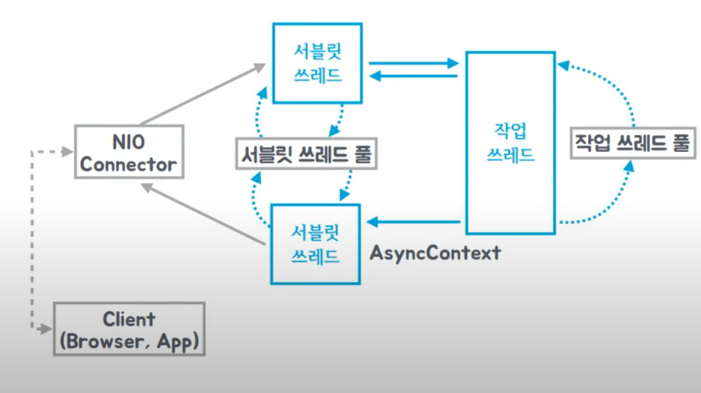
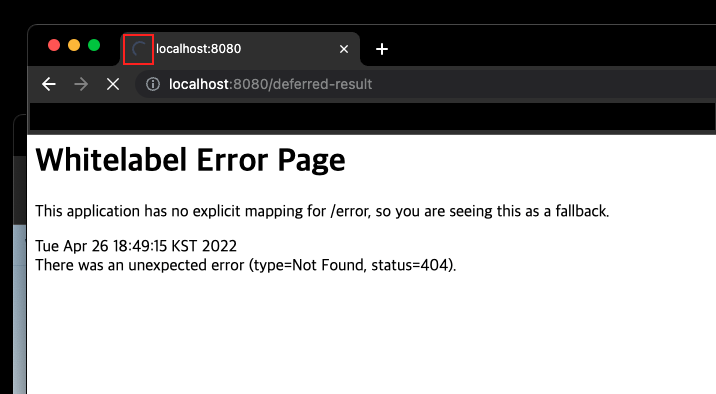
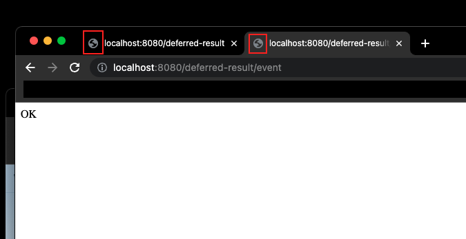
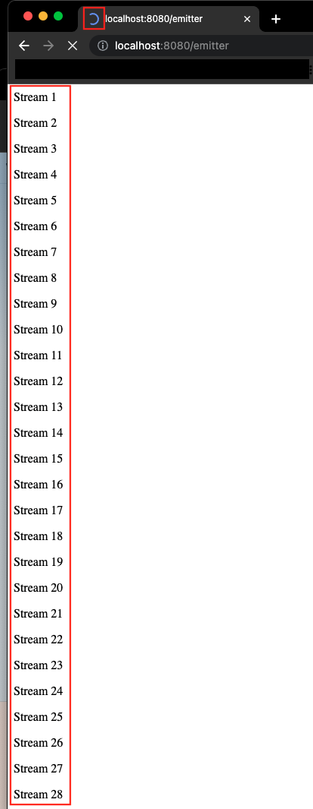

### Spring WebFlux Series - 8

지금까지 우리는 [자바의 Future(링크)](https://imprint.tistory.com/229) 와 [스프링의 Async(링크)](https://imprint.tistory.com/230) 를 학습하면서 자바와 스프링의 비동기 기술에 대해서 알아보았다.
이번 장에서는 자바와 스프링의 비교적 최신 비동기 기술에 대해서 알아보도록 한다.
모든 코드는 [깃허브 (링크)](https://github.com/roy-zz/webflux)의 테스트 코드에 있으므로 필요하다면 참고하도록 한다.

---

### 개요

#### 비동기 서블릿 출시

처음으로 비동기 서블릿이 언급되기 시작한 것은 스프링 3.0 버전부터이며 아래와 같은 기능을 가지고 있었다.

- HTTP Connection은 논블로킹 IO
- 서블릿 요청 읽기, 응답 쓰기는 블록킹
- 비동기 작업 시작 즉시 서블릿 스레드 반납
- 비동기 작업이 완료되면 서블릿 스레드를 재할당 하여 마무리
- 비동기 서블릿 컨텍스트 이용(AsyncContext)

이후 3.0 버전의 서블릿을 개선한 스프링 3.1이 등장하여 성숙한 비동기 서블릿으로 탄생하였다.

서블릿 3.0이 넘어가면서 이미 서블릿 위에서 동작하는 스프링 프레임워크를 사용하게 되었다.
서블릿 3.0에는 비동기적으로 서블릿 요청을 처리하는 기능이 추가되었다.
기본적으로 서블릿은 블록킹 구조로 이루어져 있다. 여기서 `블록킹`이 I/O에서 가지는 큰 의미는 I/O가 발생할 때마다 서블릿에서 스레드를 하나씩 할당한다는 의미다.
여기서 I/O는 HTTP로 브라우저가 요청을 하는 것과 요청을 받아서 결과를 반환하는 것을 의미한다.
이러한 구조에서는 동시에 커넥션이 100개가 생기면 스레드 또한 100개가 사용되었으며 블록킹 방식이기 때문에 어쩔 수 없는 구조였다.

---

#### 스레드와 컨텍스트 스위칭

서블릿이 기본적으로 블록킹 구조인 이유는 HTTP 커넥션과 연관되어 있는 HttpServletRequest와 HttpServletResponse 객체가 내부적으로 InputStream, OutputStream을 구현했고 여기서 사용되는 `read`와 같은 메서드는 기본적으로 블록킹 I/O 방식이기 때문이다.
`read`를 사용한 순간에 I/O쪽에서 아무런 데이터가 없으면 대기히고 있다가 어떠한 데이터가 반환되거나 커넥션이 끊어지는 경우에 반환된다.
스레드가 블록킹되는 순간 CPU는 스레드를 대기상태로 전환(스위칭 한 번)하고 다시 작업을 시작할 때 Running 상태로 바꾸면서 전환(스위칭 한 번)이 발생하면서 총 두 번의 `Context Switching`이 발생하게 된다.
이렇게 스레드 블록킹을 많이 사용하게 되면 스레드간 `Context Switching`이 많이 일어나게 되고 불필요하게 많은 CPU 자원을 사용하게 된다.

우리가 사용하는 스프링에서 기본적으로 사용되는 HttpServletRequest와 HttpServletResponse는 기본적으로 InputStream을 사용하고 있고 이미 NIO를 사용하여 한계를 극복해보려 하였지만 큰 성과는 없었다.
사실 스레드 하나가 request -> 서비스 로직 -> response를 처리하는 것은 큰 문제가 되지 않는다.
문제는 request -> DB Connection 또는 외부 API 통신 -> response와 같이 중간에 블록킹되는 작업이 있을 때 발생한다.
이러한 요청을 처리하는 스레드는 요청이 처리되기 전까지 불필요한 Context Switching을 유발하며 블로킹 상태가 되기 때문이다.
이렇게 블록킹 상태가 된 스레드가 많아지며 결국 스레드는 전부 고갈될 것이고 클라이언트의 요청은 작업을 대기하는 Queue에 쌓이게 될 것이다.
Queue까지 가득차게 되면 클라이언트는 서비스 불가라는 응답을 받게 된다. Latency는 높아지고 에러율이 높아지는 상태가 되는 것이다.

"스레드를 많이 만들면 되는거 아니냐"라는 의문이 발생할 수 있지만 자바에서 스레드는 내부적으로 `Stack Trace`를 가지고 있으며 이러한 특징은 메모리르 사용하는 것을 의미한다.
만약 많아진 요청을 스레드의 수를 늘려서 해결하려한다면 우리는 `OutOfMemory 에러`를 만나게 될 것이다.
또한 스레드가 많아지면 `Context Switching`이 기존보다 훨씬 많이 발생하게 되면서 CPU 사용량이 치솟게 되어 오히려 응답속도가 느려질 수 있다.
결국 스레드의 수를 많이 늘려서 문제를 해결하려하는 것은 근본적인 해결 방법이 아니다.

---

#### 비동기 서블릿 작동 방식

지금까지 스레드가 많아지는 경우 발생하는 문제를 살펴보았다. 
스레드의 수를 늘려서 문제를 해결하는 것은 근본적인 해결 방법이 아니며 서블릿 스레드를 효율적으로 사용하는 방법에 대해서 고민해야한다.

아래의 그림을 보면 서블릿 스레드가 블록킹 I/O를 만났을 때 응답을 대기하고 있는 것이 아니라 바로 스레드 풀로 반환되어 다음 요청을 처리하기 위해 대기한다.
이렇게 서블릿 스레드가 블록킹되지 않고 유동적으로 작업을 처리하는 방식을 `비동기 서블릿`이라고 한다.
스프링 3.0에서 나온 비동기 서블릿 기술을 스프링 3.1에서 많은 부분 보완하였고 `논블록킹 웹개발을 위한 기본`이 탄생하였다.



스프링에서 어떠한 방식으로 논블록킹 웹 개발을 가능하게 하였는지 살펴본다.

1. 가장 앞단의 NIO Connector가 클라이언트의 요청을 받는다.
2. NIO Connector는 서블릿 스레드를 생성하거나 스레드 풀에서 이미 생성되어 있는 서블릿 스레드를 가져온다.
3. 만약 스레드의 작업이 오래걸리거나 @Async와 같은 애노테이션을 사용하여 작업 스레드에게 작업을 위임하면 바로 스레드 풀로 반환된다.

여기서 "처리 중이던 서블릿 스레드를 반납하면 처리된 결과는 누가 HTTP 응답으로 처리할 것인가"라는 문제가 발생하게 된다.
이러한 문제는 비동기 서블릿 엔진 자체적으로 작업 스레드가 작업을 마치고 반환하는 시점에 스레드 풀에서 스레드를 재할당하여 NIO Connector에게 응답을 반환하고 바로 서블릿 스레드를 반납한다.
이러한 메커니즘을 활용하여 비동기 서블릿은 적은 스레드의 수로 동시에 많은 요청을 처리할 수 있다.

지금부터 비동기 서블릿 엔진의 작동 방식을 살펴보기 위해 코드로 살펴보도록 한다.

```java
@RestController
@RequiredArgsConstructor
public static class MyController {
    private final MySpringService mySpringService;
    @GetMapping("/sync")
    public String sync() throws InterruptedException {
        log.info("Call sync");
        heavyJob();
        log.info("Finish heavyJob()");
        return "HELLO";
    }

    @GetMapping("/callable-async")
    public Callable<String> callableAsync() {
        log.info("Call callable async");
        return () -> {
            log.info("Call async method");
            heavyJob();
            log.info("Finish heavyJob");
            return "HELLO";
        };
    }

    private void heavyJob() throws InterruptedException {
        TimeUnit.SECONDS.sleep(2);
    }
}
```

`/async` API에서 처리하는데 2초가 소요되는 heavyJob 메서드를 호출한다. 우리의 서블릿은 동기 방식으로 작동하기 때문에 heavyJob을 처리할 때 까지 서블릿의 스레드(nio-8080-exec-1)는 블로킹되어 있을 것이다.
출력된 결과는 아래와 같다.

```bash
2022-04-26 18:13:27  [nio-8080-exec-1]: Call sync
2022-04-26 18:13:29  [nio-8080-exec-1]: Finish heavyJob()
```

이러한 경우 `Callable`을 사용하여 heavyJob을 비동기로 작동시키면 다른 스레드에서 작업을 처리하게 되면서 문제는 해결된다.

```bash
2022-04-26 18:16:05 [nio-8080-exec-1]: Call callable async
2022-04-26 18:16:05 [      MvcAsync1]: Call async method
2022-04-26 18:16:07 [      MvcAsync1]: Finish heavyJob
```

우리가 비동기 방식으로 작동하는 코드를 컨트롤러에서 반환하면 스프링에서 비동기로 해당하는 코드를 실행시킨 후에 작업이 끝나면 반환하게 된다.
그리고 컨트롤러 메서드에서 출력한 `Call callable async`를 출력한 스레드는 `nio-8080-exec-1`인 것을 확인할 수 있으며 해당 스레드는 비동기 작업인 heavyJob() 메서드가 종료되기를 기다리지 않고 다음 작업을 처리하기 위해 바로 반환된다.
이렇게 비동기로 작동하면 서블릿 스레드는 같은 시간동안 많은 요청을 처리할 수 있게 되고 애플리케이션 전반적인 `Throughput`이 높아진다.

---

#### Deferred Result

우리는 정말 최소한의 서블릿 스레드로 요청을 처리하기 위해서 DeferredResult를 사용할 수 있다.
DeferredResult를 테스트하기 위한 코드를 확인해본다.
요청이 들어왔을 때 DeferredResult 객체를 생성하여 저장 할 큐를 생성하였다.
`/deferred-result` API는 고객의 요청이 들어오면 바로 처리하는 것이 아니라 위에서 만들었던 큐에 집어넣는다.
`/deferred-result/count` 큐의 사이즈를 반환한다.
`/deferred-result/event` 큐에 담겨있는 모든 DeferredResult 객체를 처리하고 큐에서 제거한다.

```java
@Slf4j
@EnableAsync
@SpringBootApplication
public class WebfluxApplication {
    private final Queue<DeferredResult<String>> results = new ConcurrentLinkedQueue<>();
    @GetMapping("/deferred-result")
    public DeferredResult<String> deferredResult() throws InterruptedException {
        log.info("Call deferred result");
        DeferredResult<String> dr = new DeferredResult<>();
        results.add(dr);
        return dr;
    }
    @GetMapping("/deferred-result/count")
    public String deferredCount() {
        return String.valueOf(results.size());
    }
    @GetMapping("/deferred-result/event")
    public String deferredEvent(String message) {
        for (DeferredResult<String> dr : results) {
            dr.setResult("Hello " + message);
            results.remove(dr);
        }
        return "OK";
    }
}
```

브라우저를 켜고 localhost:8080/deferred-result에 접속하면 브라우저는 아무런 화면도 뜨지 않고 브라우저는 계속 서버의 응답을 받기 위해 대기할 것이다.



브라우저에서 새창을 켜고 새로운 창에서 localhost:8080/deferred-result/event를 호출하면 대기하던 브라우저에 요청이 완료되는 것을 확인할 수 잇다.



`DeferredResult`는 setResult 또는 setException이 발생하기 전까지 응답하지 않고 대기상태로 존재한다.
`DeferredResult`의 최대 장점은 작업을 처리하기 위해 새로운 스레드를 만들지 않는다는 점이다.
`DeferredResult` 객체만 유지하고 있으면 언제든지 객체를 불러와서 결과를 넣어주면 컨트롤러에서 응답값을 반환하는 것과 같이 바로 결과를 반환한다.
한정된 자원을 최대의 효율로 처리하는데 좋은 방식이다. 물론 이벤트성 구조인 경우 유리하다.

---

### Emitter

HTTP 요청에 대한 반환 타입이 스트림 방식이면 HTTP 응답은 여러번에 걸쳐서 이뤄진다. 
이러한 응답 유형을 가지는 객체는 ResponseBodyEmitter, SseEmitter, Streaming ResponseBody 세가지가 있으며 모두 같은 역할을 한다.
우리는 이들 중 ResponseBodyEmitter에 대해서 알아본다.
우리는 0.1초 간격으로 50번 HTTP 응답이 발생하길 바라면서 아래와 같은 컨트롤러를 작성하였다.

```java
@Slf4j
@EnableAsync
@SpringBootApplication
public class WebfluxApplication {
    @GetMapping("/emitter")
    public ResponseBodyEmitter emitter() {
        ResponseBodyEmitter emitter = new ResponseBodyEmitter();
        Executors.newSingleThreadExecutor().submit(() -> {
            try {
                for (int i = 1; i <= 50; i++) {
                    emitter.send("<p>Stream " + i + "</p>");
                    Thread.sleep(100);
                }
            } catch (Exception e) {}
        });
        return emitter;
    }
}
```

localhost:8080/emitter 페이지에 접속하여 출력되는 결과를 확인해보면 0.1초 간격으로 지속적으로 데이터가 출력되는 것을 확인할 수 있다.



---

우리는 지금까지 자바와 스프링의 최신 비동기 기술에 대해서 살펴보았다.
다음 장에서는 이번 장에서 살펴 본 비동기 기술이 동기 방식보다 어떠한 장점이 있는지 살펴보도록 한다.

---

**참고한 강의:**

- https://www.youtube.com/watch?v=aSTuQiPB4Ns&ab_channel=TobyLee


