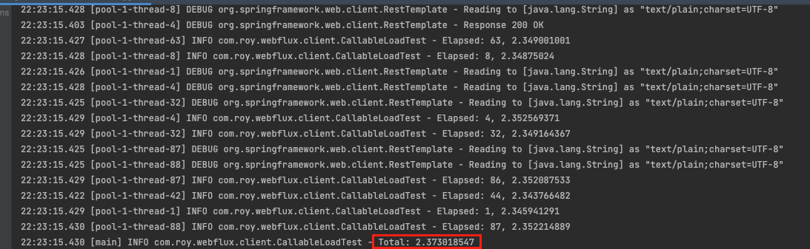
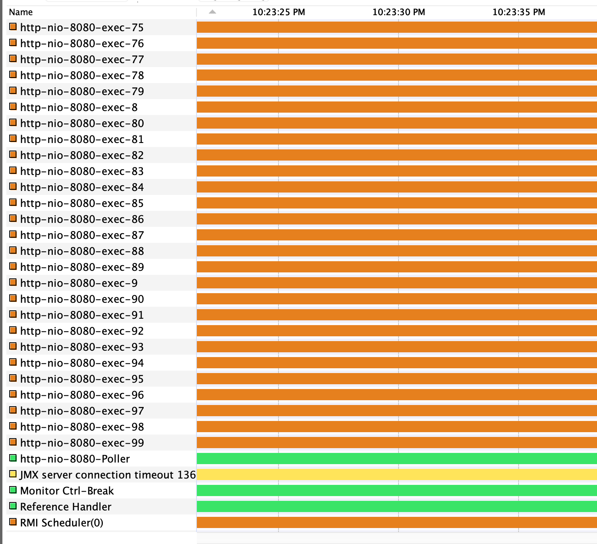
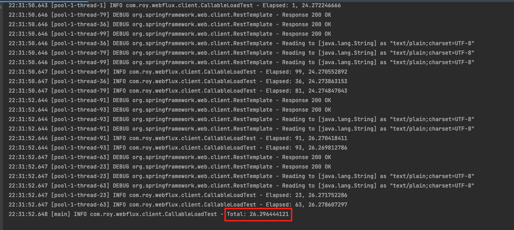
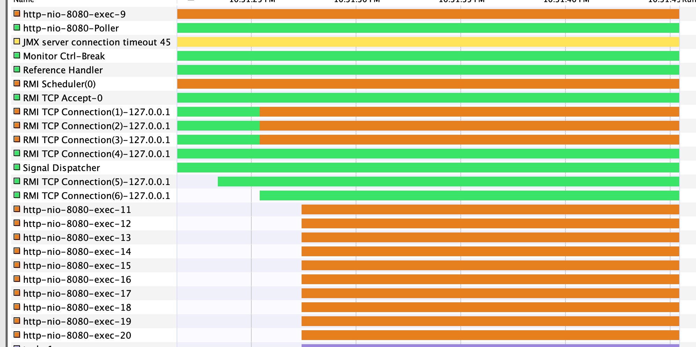
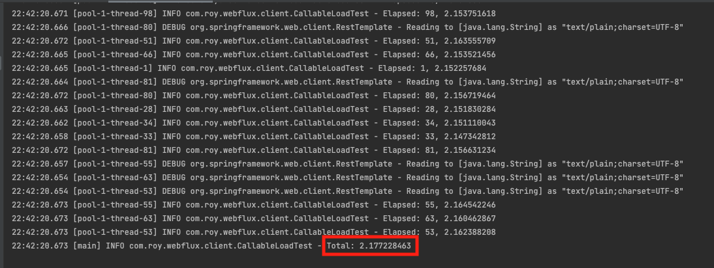
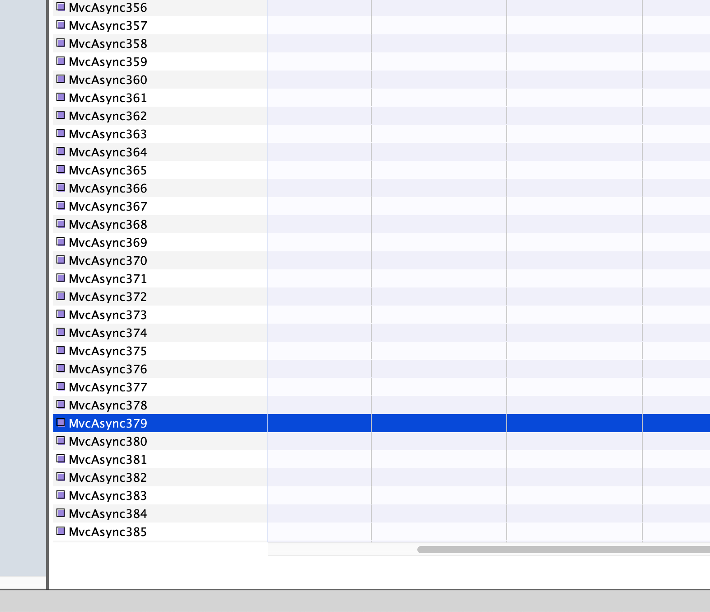

### Spring WebFlux Series - 9

지금까지 우리는 [자바의 Future(링크)](https://imprint.tistory.com/229) 와 [스프링의 Async(링크)](https://imprint.tistory.com/230) 를 학습하면서 자바와 스프링의 비동기 기술에 대해서 알아보았다.
이번 장에서는 동기 방식과 비동기 방식으로 작성되어 있는 컨트롤러 코드를 부하 테스트를 통하여 성능을 확인하는 시간을 가져본다.
모든 코드는 [깃 허브 (링크)](https://github.com/roy-zz/webflux)의 테스트 코드에 있으므로 필요하다면 참고하도록 한다.

---

### 부하 테스트 설정

지금까지 계속 비동기 서블릿 방식으로 웹 개발을 해야 한정된 자원을 활용하여 더 많은 요청을 처리할 수 있다고 학습하였다.
정말로 우리가 학습한 내용이 맞는지 부하 테스트를 진행하여 결과를 확인해본다.
결과를 확인하기에 앞서 이번 단계에서는 스레드 상태를 직접 눈으로 확인하기 위해 [VisualVM(링크)](https://visualvm.github.io/) 이라는 툴을 사용할 것이다.

**StressTest**

부하 테스트를 위하여 StressTest라는 클래스를 작성하였고 HTTP Request를 발생시키는 클라이언트 역할을 한다.
이번에는 한 번에 100개의 요청을 발생시켜 컨트롤러가 한 번에 100개의 요청을 처리하게 하는 역할을 한다.

```java
@Slf4j
@EnableAsync
public class CallableLoadTest {
    private static final AtomicInteger sequence = new AtomicInteger(0);
    public static void main(String[] args) throws InterruptedException {
        ExecutorService es = Executors.newFixedThreadPool(1000);
        RestTemplate rt = new RestTemplate();
        String url = "http://localhost:8080/sync";
        // String url = "http://localhost:8080/callable-async";
        StopWatch main = new StopWatch();
        main.start();
        for (int i = 0; i < 100; i++) {
            es.execute(() -> {
                int index = sequence.addAndGet(1);
                log.info("Thread {}", index);
                StopWatch sw = new StopWatch();
                sw.start();
                rt.getForObject(url, String.class);
                sw.stop();
                log.info("Elapsed: {}, {}", index, sw.getTotalTimeSeconds());
            });
        }
        es.shutdown();
        es.awaitTermination(100, TimeUnit.SECONDS);
        main.stop();
        log.info("Total: {}", main.getTotalTimeSeconds());
    }
}
```

**AsyncSpringController**

동기 방식으로 처리되는 `/sync` API와 비동기 Callable 방식으로 처리되는 `/callable-async`를 가지고 있다.

```java
@RestController
public static class AsyncSpringController {
    @GetMapping("/sync")
    public String sync() throws InterruptedException {
        log.info("Call sync");
        TimeUnit.SECONDS.sleep(2);
        return "HELLO";
    }

    @GetMapping("/callable-async")
    public Callable<String> callableAsync() throws InterruptedException {
        log.info("Call async async");
        return () -> {
            log.info("Call async method");
            TimeUnit.SECONDS.sleep(2);
            return "HELLO";
        };
    }
}
```

**application.yml**

한정된 자원을 맞추기 위하여 application.yml을 수정해가면서 톰캣의 스레드 수를 조절한다.

```yaml
server:
  tomcat:
    threads:
      max: 100
```

---

### 부하 테스트 

1. Sync Controller (Tomcat Thread 200, Request 100)

모든 요청을 처리하는데 2.37초가 소요되었다. 생각보다 빠른 결과다.



하지만 생성된 VisualVM을 통해 생성된 스레드를 보면 `http-nio-8080-exec-*` 스레드가 100개 생성된 것을 볼 수 있다.
톰캣의 기본 스레드 풀의 크기가 200개이므로 100개의 요청은 당연히 처리가 가능하다.



---

2. Sync Controller (Tomcat Thread 20, Request 100)

이번에는 `application.yml` 파일을 아래와 같이 수정하여 톰캣의 스레드 수를 20으로 제한하고 동일한 테스트를 진행한다.

```yaml
server.tomcat.threads.max: 20
```

한 번에 처리가능한 양이 줄어들면서 소요되는 속도도 현저하게 떨어지는 것을 확인할 수 있다.



요청이 들어왔을 때 사용되는 스레드 또한 우리가 제한한 수치인 20을 넘지 않는 것을 확인할 수 있다.



---

3. Async Controller (Tomcat Thread 20, Request 100)

2번 테스트와 동일한 상황에서 비동기 컨트롤러는 어떻게 동작하는지 테스트를 진행한다.
테스트 결과를 보면 톰캣의 스레드는 20개밖에 안되지만 2초 안에 처리된 것을 확인할 수 있다.



하지만 중요한 것은 작업 스레드의 수다.
비동기 처리 또한 동기와 유사하게 작업 스레드가 요청 수만큼 생성되어 요청을 처리한 것을 확인할 수 있다.



결국 이러한 비동기 처리는 요청 수만큼 작업 스레드를 생성하는 사태를 유발하며 적은 리소스로 많은 요청을 처리한다는 비동기 처리의 장점과는 맞지 않는다.
작업 스레드를 따로 두는 것을 효율적으로 활용하기 위해서는 모든 작업을 작업 스레드에서 처리하는 것이 아니라 일반적인 요청은 서블릿 스레드에서 처리하고 오랜 시간이 걸리는 작업만 작업 스레드를 사용하여 일반 작업과 무거운 작업을 분리해서 활용해야 한다.

---

**참고한 강의:**

- https://www.youtube.com/watch?v=aSTuQiPB4Ns&ab_channel=TobyLee