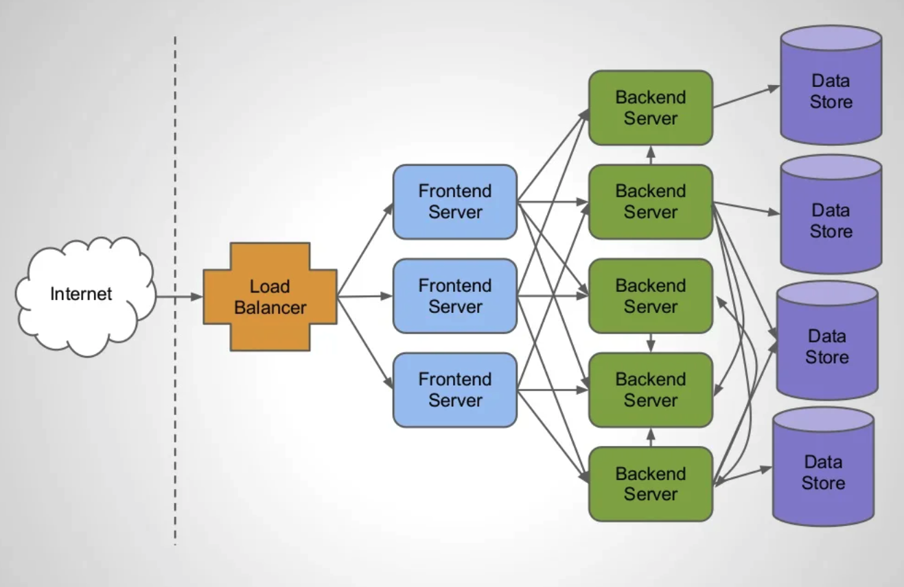

우리는 지금까지 [Future](https://imprint.tistory.com/229?category=1067652), [@Async](https://imprint.tistory.com/230?category=1067652), [Modern](https://imprint.tistory.com/234?category=1067652), [Stress Test](https://imprint.tistory.com/236?category=1067652)를 통해서 자바와 스프링의 원시적인 비동기 기술에 대해서 학습하였다.
이번 장에서는 링크드인의 발표자료를 보면서 서비스간에 통신으로 인해 발생하는 블록킹과 JMC 툴, CyclicBarrier를 통한 스레드 동기화에 대해서 알아보도록 한다.

### 개요

하나는 Callable을 사용하여 서블릿이 HTTP 요청을 받았을 때 뒤에 있는 워커 스레드에게 할당하고 서블릿 스레드는 빠르게 반납되어 처리되어 다음 요청을 처리하는 ???에 대해서 학습하였다.
다른 하나는 DeferredResult라는 결과를 쓸 수 있는 Object를 생성하여 서블릿 스레드는 바로 결과를 반환하고 나중에 이벤트가 발생하거나 적정한 타이밍에 이전에 생성된 DeferredResult Object에 결과 값을 쓰는 방식을 학습하였다.
강제로 톰캣의 스레드를 하나로 제한하고 100개의 요청을 처리하는 것에 대해서 학습하였다.
하지만 이러한 방식만을 가지고 딱히 사용할 만한 부분이 보이지 않는다는 단점이 있다.

중간에 블록킹 I/O가 발생하지 않는다면 굳이 비동기적으로 작동할 필요없이 빠르게 요청을 처리해서 반환해도 상관없다.
하지만 서비스단에서 다른 서비스를 호출하는 로직이 많은 경우에 단순히 비동기 서블릿을 사용하는 것만으로는 해결할 수 없는 부분들이 있다.


`링크드인`에서 `Thread pool Hell`이라는 이름으로 발표한 자료를 확인해본다.
자바의 스레드 풀은 클라이언트의 요청이 들어오면 풀에서 나와서 처리하고 요청을 처리하고 반납된다.
만약 작업을 완료하기까지 오랜 시간이 걸리는 작업을 처리하기 위해 스레드들이 전부 작업을 진행하게 되면 스레드 풀은 비어있는 상태가 될 것이다.

위의 이미지를 확인해보면 클라이언트의 요청이 많지 않을 때는 상관없지만 12 ~ 16 부분을 살펴보면 요청이 늘어나면서 스레드 풀의 사용량도 같이 높아졌다.
사용량이 높아지다가 14시에 스레드 풀 사용량이 최대치를 달성하였는데 이미지의 하단부 그래프를 살펴보면 최대치를 달성함과 동시에 작업을 처리할 스레드가 없어서 다른 작업을 기다리고 처리(동기)하기 때문에 Latency가 급격하게 높아지는 것을 확인할 수 있다.

옛날 서비스들은 하나의 큰 서비스안에 대부분의 기능이 추가되어있는 `Monolithic` 구조였다.
하지만 최근에는 하나의 기업 안에서도 서비스의 성격에 따라 Frontend 프로젝트도 여러개, Backend 프로젝트도 여러개로 구성되는 `MSA(Microservice Architecture)`로 구성하는 추세이다.

왜 이러한 현상이 발생하는지도 `링크드인`에서 분석하였다. 아래는 요즘 많이 구축하는 서비스 구조이다.
(링크드인의 발표자료는 pdf파일로 첨부한다.)



하나의 클라이언트 요청을 받은 서버가 처리하는 동안에 또 다른 원격 서버에 요청을 보내고 최종적으로 결과를 조합하여 반환하는 형태다.
백엔드 서버가 최적화가 잘 되어 있어서 요청 하나를 0.1초안에 처리한다고 가정해본다. 
`Profile frontend` 서버가 총 다섯개의 백엔드 서버에게 요청을 동적으로 보내서 대기하게 되면 `Profile frontend` 서버의 서블릿 스레드는 총 0.5초간 아무런 작업도 진행하지 못하고 블록킹되어 있어야한다.
혼자 처리하였으면 빠르게 처리하고 반납했을 스레드가 다른 서비스의 요청을 기다리면서 블록킹되고 이러한 이유로 스레드 풀의 사용량은 점차 높아지게 된다.

여기서 주목할 포인트는 구축되어 있는 서비스가 부하에 대비하여 충분하지 못했거나 아키텍쳐적으로 문제가 있었다면 서비스를 확장하고 구조를 개선하면 해결되는 문제다.
`Profile frontend`서버가 `Profile backend`에게 요청하고 대기하는 상황을 가정하였을 때 `Profile Frontend`서버의 스레드는 `Profile Backend`서버에 요청을 보내고 대기하면서 쉬고 있다.
여기서 쉬고 있다는 의미는 서버의 리소스(특히 CPU)를 사용하지 않고 있다는 의미가 된다. 가끔 서비스의 리소스 모니터링을 하다보면 서비스의 리소스는 여유로운 상황인데 전체적인 성능이 낮은 경우가 있다.
많은 이유가 있겠지만 스레드가 부족한 경우도 동일한 현상이 발생한다. 이러한 이유를 해결하기 위해서 스레드 자체의 수를 늘리는 것은 좋은 해결방법은 아니다.
스레드는 각각 고유하게 메모리를 사용하고 있으며 생성되고 사라질 때 CPU 또한 많이 사용하게 된다. 스레드가 블록킹 상태로 변경될 때 즉시 `Context Switching`이 발생하는데 `Context Switching`은 시스템의 리소스를 상당히 많이 사용하는 작업이다.
특히 스레드의 수가 많아지면 많아질수록 `Context Switching`의 수도 많아지게 되며 결론적으로 서비스의 성능이 향상되는 효과보다 리소스의 사용량이 높아지는 결과를 맞이하게 된다.
기존에는 외부 서비스를 호출할 때 많이 발생하던 문제였지만 최근에는 대부분의 기업들이 `MSA(Microservice Architecture)`로 구조를 잡으면서 회사내부 서비스 간의 통신에도 추가로 시간이 소요되게 되었다.

---

### 테스트

우리는 이러한 문제를 가지고 스프링에서 어떠한 방식으로 처리했는지에 대해서 살펴보도록 한다.

톰캣의 스레드를 1개로 설정하고 단순 동기방식으로 "Rest"라는 문자열을 처리하는 API를 호출할 것이다.
요청은 동시에 총 100개가 발생할 것이며 어떻게 작동하는지 확인해보도록 한다.

**application.yml**
```yaml
server.tomcat.threads.max: 1
```

**MvcController**
```java
@RestController
@RequestMapping("/mvc")
public class MvcController {
    @GetMapping(value = "/rest")
    public String rest() {
        return "HELLO";
    }
}
```

**MvcClient**
```java
@Slf4j
@EnableAsync
public class MvcClient {
    private static final AtomicInteger sequence = new AtomicInteger(0);
    public static void main(String[] args) throws InterruptedException {
        ExecutorService es = Executors.newFixedThreadPool(1000);
        RestTemplate rt = new RestTemplate();
        String url = "http://localhost:8080/mvc/rest";
        StopWatch main = new StopWatch();
        main.start();
        for (int i = 0; i < 100; i++) {
            es.execute(() -> {
                int index = sequence.addAndGet(1);
                log.info("Thread {}", index);
                StopWatch sw = new StopWatch();
                sw.start();
                rt.getForObject(url, String.class);
                sw.stop();
                log.info("Elapsed: {}, {}", index, sw.getTotalTimeSeconds());
            });
        }
        es.shutdown();
        es.awaitTermination(100, TimeUnit.SECONDS);
        main.stop();
        log.info("Total: {}", main.getTotalTimeSeconds());
    }
}
```

결과를 확인해보면 작업을 처리할 수 있는 톰캣 스레드는 하나밖에 없지만 처리 시간도 짧기때문에 100개의 처리를 0.2초 대에 처리할 수 있었다


우리가 작성한 코드가 어떻게 작동하는지 `JMC`라는 새로운 툴과 함께 살펴보도록 한다.

---

### JMC(JDK Mission Control)

**주의**
`JMC`를 살펴보기 전에 `JMC`의 라이선스 특성상 상업용으로 사용하게 되면 비용을 지불해야한다.
반드시 개발용도나 테스트 용도로만 사용하거나 운영용도로 사용하기 위해서는 회사와 협의 후에 사용해야한다.

이전 장에서 살펴 본 `VisualVM`과 비슷한 역할을 하지만 더 편한 UI/UX와 더 많은 기능을 제공하는 툴이다.
강의에서는 터미널에 `jmc` 커맨드를 입력하면 실행된다고 안내하고 있지만 필자의 경우 `jmc` 커맨드를 입력하면 아래와 같은 오류가 발생하여 [공식 홈페이지(링크)](https://jdk.java.net/jmc/8/)에서 직접 다운로드 하였다.

```bash
The operation couldn’t be completed. Unable to locate a Java Runtime that supports jmc.
Please visit http://www.java.com for information on installing Java.
```

파일을 다운로드 받으면 `jmc8.2.0_~~~.tar.gz`와 같은 형식의 압축파일이 생기며 해당 파일의 압축을 해제하면 JDK Mission Control이라는 실행프로그램이 나온다.


실행 프로그램을 실행시켜서 아랴와 같은 화면이 나온다면 사용 준비가 완료된 것이다.


---

#### JMC 기능 살펴보기

이전에 우리는 톰캣 스레드가 하나만 생성되도록 설정값을 변경하여 프로젝트를 실행시켰다.
정말로 하나만 실행되었는지 `JMC`를 사용하여 확인해본다.


화면 좌측에서 우리의 애플리케이션을 선택한다. 
화면의 하단부에 `Threads` 탭을 선택한다.
`http-nio-8080-exec-*` 스레드가 정말 하나인지 확인한다.


`Live Thread Graph`를 선택하여 최대 스레드와 현재 스레드와 같은 정보를 확인할 수 있다.
스레드를 선택하고 `Stack Traces for Selected Threads`를 선택해서 스레드의 실시간 Stacktrace 정보를 확인할 수 있다. 

---

#### CyclicBarrier

위에서 살펴보았던 `MvcClient`는 단점이 있다. 스레드를 100개를 만들고 반복문을 돌면서 순차적으로 스레드를 실행한다.
결국 동시에 실행되는 것처럼 보이지만 우리가 느끼지 못할 만큼 순차적으로 빠르게 처리된 것이다.

100개의 스레드를 생성하고 정말로 한 번에 모든 스레드를 실행시키는 `동기화` 비법에 대해서 알아본다.
자바에서 사용하기에 가장 간단한 `동기화`방법으로 `CyclicBarrier`라는 방법이 있다.
`CyclicBarrier`는 최초에 Object를 생성할 때 경계를 지정한다. 예를 들어 아래와 같이 객체를 생성하였고 A ~ E까지 총 다섯개의 스레드가 있다고 가정해본다.

```java
CyclicBarrier barrier = new CyclicBarrier(5);
```

경계를 5로 설정하였고 barrier.await()라는 코드를 작성하였다.
`A`라는 스레드가 barrier를 만나는 순간 `A`라는 스레드는 블록킹된다. `B`라는 스레드도 barrier를 만나는 순간 블록킹된다.
다섯번째인 `E`라는 스레드가 barrier.await()를 만나는 순간 우리가 지정한 5라는 경계에 도달하게되고 블록킹되어 있던 4개의 스레드와 E라는 스레드가 작동하게 된다.
이렇게 우리가 지정한 값이 되었을 때 블록킹되었던 스레드들이 한 번에 처리되도록 유도하여 `스레드 동기화`를 구현할 수 있다.

`CyclicBarrier`를 적용하기 위해 MvcClient 클래스를 복사하여 MvcClient2라는 클래스를 생성하였다.

```java
@Slf4j
@EnableAsync
public class MvcV2Client {
    private static final AtomicInteger sequence = new AtomicInteger(0);
    public static void main(String[] args) throws InterruptedException, BrokenBarrierException {
        ExecutorService es = Executors.newFixedThreadPool(1000);
        RestTemplate rt = new RestTemplate();
        String url = "http://localhost:8080/mvc/rest";
        CyclicBarrier barrier = new CyclicBarrier(101);
        for (int i = 0; i < 100; i++) {
            es.execute(() -> {
                int index = sequence.addAndGet(1);
                try {
                    barrier.await();
                } catch (InterruptedException | BrokenBarrierException e) {
                    e.printStackTrace();
                }
                log.info("Thread {}", index);
                StopWatch sw = new StopWatch();
                sw.start();
                rt.getForObject(url, String.class);
                sw.stop();
                log.info("Elapsed: {}, {}", index, sw.getTotalTimeSeconds());
            });
        }
        barrier.await();
        StopWatch main = new StopWatch();
        main.start();
        es.shutdown();
        es.awaitTermination(100, TimeUnit.SECONDS);
        main.stop();
        log.info("Total: {}", main.getTotalTimeSeconds());
    }
}
```

`ExecutorService`의 execute 메서드의 파라미터 타입은 `Runnable`이라는 인터페이스다.
`Runnable` 인터페이스의 구현체는 기본적으로 `Exception`을 밖으로 던질 수(throwable)없고 내부적으로 try catch를 사용하여 해결해야 한다.
이러한 이유로 람다 표현식안에 try catch 문이 존재하게 되고 코드는 복잡해지게 된다.

그렇다면 우리는 `ExecutorService`를 사용하면서 `Exception`을 밖으로 던지게 하기위해서는 어떻게 해야하는지 알아본다.
우리는 이전 장에서 `Runnable`과 `Callable`의 차이에 대해서 알아보았다. 
**Runnable**은 리턴값이 없으며 Exception을 던질 수 없다.
**Callable**은 리턴값이 존재하며 Exception 또한 던질 수 있다.

`ExecutorService`의 `execute` 메서드는 파라미터가 Runnable만 가능하기 때문에 호출하는 메서드를`submit`메서드로 변환한다.
익명 객체는 선언부가 없기 때문에 컴파일러가 Runnable의 구현체를 작성한 코드인지 Callable의 구현체를 작성한 코드인지 추론할 수 있게 하기위해 리턴값을 만들어야 한다.
의미없는 반환 값인 `null`을 반환하도록 수정된 코드는 아래와 같다. (동일한 코드는 생략하고 람다 표현식 내부만 적는다.)

```java
for (int i = 0; i < 100; i++) {
    es.submit(() -> {
        int index = sequence.addAndGet(1);
        barrier.await();
        log.info("Thread {}", index);
        StopWatch sw = new StopWatch();
        sw.start();
        rt.getForObject(url, String.class);
        sw.stop();
        log.info("Elapsed: {}, {}", index, sw.getTotalTimeSeconds());
        return null;
    });
}
```

코드를 실행시켜보면 출력되는 결과는 아래와 같다.
스레드가 생성되는 순서를 살펴보면 이전과 다르게 스레드의 순서가 일정하게 늘어나지 않는 것을 확인할 수 있다.
출력값만 보더라도 `스레드 동기화가 정상적`으로 이루어진 것을 확인할 수 있다.


---

지금까지 `MSA` 구조에서 블록킹이 발생하는 원인에 대해서 알아보고 Thread의 상태를 확인하기 위해 `JMC`를 사용하는 방법에 대해서 알아보았다.
추가로 `CyclicBarrier`를 사용하여 스레드 동기화처럼 보이는 것이 아니라 정말로 `스레드가 동기화`되어 작동하는 코드를 작성해보았다.
다음 장에서는 서비스간의 통신이 잦아서 블록킹이 많이 발생하는 `MSA` 구조에서 어떻게 블록킹 문제를 해결할 수 있는지 알아본다.

---

**참고한 강의**

- https://www.youtube.com/watch?v=ExUfZkh7Puk