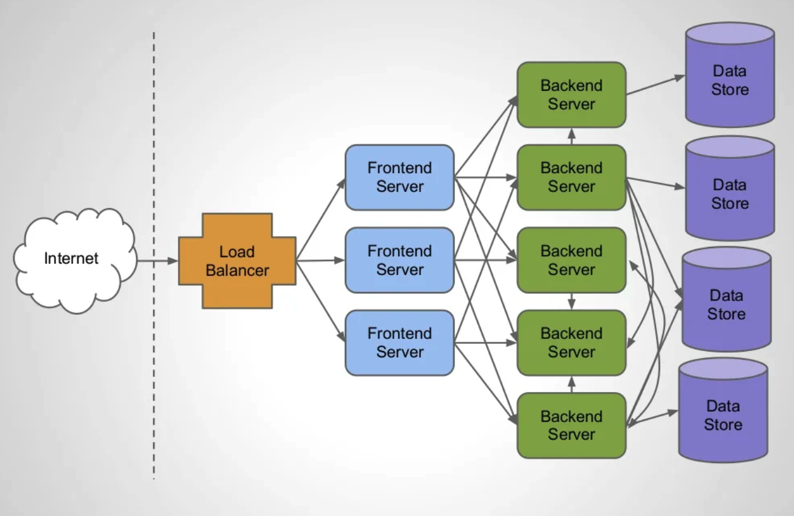
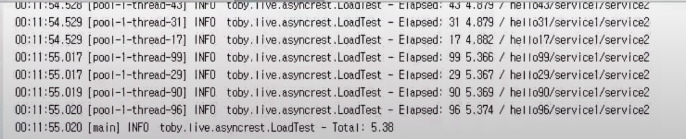
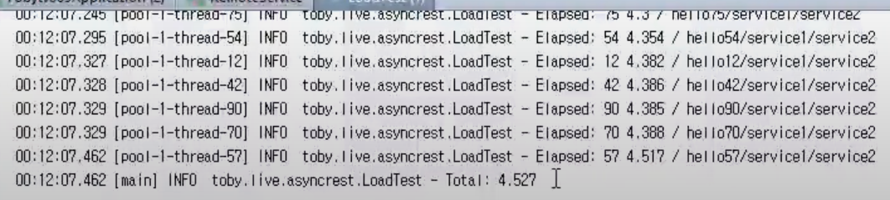
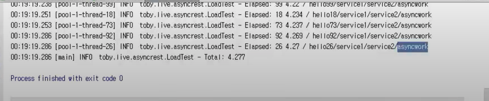

### Spring WebFlux Series - 12

[이전 장(링크)](https://imprint.tistory.com/240) 에서는 `AsyncRestTemplate`과 `DeferredResult`를 통해서 비동기 컨트롤러를 구현하였다.
이번 장에서는 두 기술을 사용하여 여러 외부 통신을 통해서 복잡한 요청구조를 어떻게 처리하는지에 대해서 알아본다.
모든 코드는 [깃 허브 (링크)](https://github.com/roy-zz/webflux)의 테스트 코드에 있으므로 필요하다면 참고하도록 한다.

---

### 개요

복잡한 요청 구조라고 하면 조금 추상적으로 느껴질 수 있다. 이전에 살펴보았던 링크드인의 발표자료를 다시 한 번 살펴본다.



`Profile frontend`를 보면 `Profile backend`, `Search backend`, `Company backend`를 직접 요청하여 조합된 결과를 클라이언트에게 반환하고 있다.
이렇게 한 번에 여러개의 외부 API를 요청해서 결과를 조합하는 방식을 비동기로 동시에 처리할 수 있는가 라는 의문이 들 수 있다.
결과는 여러개의 외부 API 요청 또한 비동기로 동시에 처리가 가능하다. 어떠한 방식으로 처리해야하는지 알아보도록 한다.

---

### 여러 외부 API 호출

여러 개의 외부 API를 호출하는 상황을 연출하기 위해 `RemoteService`에 API를 하나 추가하였다.

```java
@Slf4j
@EnableAsync
@SpringBootApplication
public class RemoteService {
    @RestController
    public static class RemoteController {
        @GetMapping("/remote-service-1/{request}")
        public String service1(@PathVariable String request) throws InterruptedException {
            TimeUnit.SECONDS.sleep(2);
            return String.format("remote-service-1: %s", request);
        }
        @GetMapping("/remote-service-2/{request}")
        public String service2(@PathVariable String request) throws InterruptedException {
            TimeUnit.SECONDS.sleep(2);
            return String.format("remote-service-2: %s", request);
        }
    }
    // 생략...
}
```

`MyService` 또한 클라이언트가 요청할 수 있도록 `/my-service/async-complex/{idx}`라는 API가 추가되었다.
처음 요청을 Callback 형식으로 받아서 성공하는 경우 다음 API를 요청하도록 구현하였다. ~~(벌써 Callback 지옥이 보이기 시작한다.)~~

```java
@Slf4j
@EnableAsync
@SpringBootApplication
public class MyService {
    @RestController
    public static class MyController {
        private AsyncRestTemplate nettyRestTemplate = new AsyncRestTemplate(new Netty4ClientHttpRequestFactory(
                new NioEventLoopGroup(1)
        ));
        // 생략... 
        @GetMapping("/my-service/async-complex/{idx}")
        public DeferredResult<String> complexAsyncService(@PathVariable String idx) {
            DeferredResult<String> deferredResult = new DeferredResult<>();
            ListenableFuture<ResponseEntity<String>> future1 = nettyRestTemplate.getForEntity(
                    "http://localhost:8081/remote-service-1/{request}", String.class, idx);
            future1.addCallback(success -> {
                ListenableFuture<ResponseEntity<String>> future2 = nettyRestTemplate.getForEntity(
                        "http://localhost:8081/remote-service-2/{request}", String.class, Objects.requireNonNull(success).getBody());
                future2.addCallback(success2 -> {
                            deferredResult.setResult(Objects.requireNonNull(success2).getBody());
                        }, ex2 -> {
                            deferredResult.setErrorResult(ex2.getMessage());
                        });
                }, ex -> {
                deferredResult.setErrorResult(ex.getMessage());
            });0
            return deferredResult;
        }
    }
    // 생략... 
}
```

100개의 요청이 총 4초가 걸리는 API를 호출하였을 때 어떻게 작동하는지 살펴보도록 한다.
이번에도 필자의 코드는 비동기로 동작하지 않아서 강의에 나온 출력을 사용하겠다.



결과를 확인해보면 우리가 예상한 것과 비슷하게 4 ~ 5초 정도의 시간이 소요되었다.
5초를 넘은 이유는 아직 워밍업이 되지 않은 상태라서 발생하는 현상이며 퍼포먼스 테스트를 진행하기 위해서는 반드시 워밍업을 진행하고 진행해야한다.



테스트를 다시 실행시켜 보면 4.5초로 실행시간이 많이 줄어든 것을 확인할 수 있다.
이 정도 구현이면 우리는 서버 자원을 효율적으로 사용하면서 높은 성능으로 작동하는 코드를 작성했다고 볼 수 있다.

---

### 내부 로직 추가

현재는 외부 API만 처리해서 바로 반환을 하는 상황이고 여기에 `MyService`의 내부 로직까지 추가되는 상황을 만들어본다.

`MyLogic`이라는 서비스 클래스를 추가하였다.
단순 `@Async`를 사용하는 경우 스레드를 무한대로 만들기 때문에 우리가 정의한 스레드 풀을 스프링 빈으로 등록한다.

**MyLogic**
```java
@Service
public class MyLogic {
    @Async
    public ListenableFuture<String> work(String request) {
        return new AsyncResult<>(String.format("asyncwork/%s", request));
    }
}
```

`MyService`에서 `MyLogic`을 비동기로 요청하도록 코드를 수정한다.
복잡한 Callback 지옥이지만 비동기 코드 부분은 전부 비동기로 백그라운드에서 동작한다.

**MyService**
```java
@Slf4j
@EnableAsync
@SpringBootApplication
public class MyService {
    @RestController
    public static class MyController {
        private AsyncRestTemplate nettyRestTemplate = new AsyncRestTemplate(new Netty4ClientHttpRequestFactory(
                new NioEventLoopGroup(1)
        ));
        private AsyncRestTemplate asyncRestTemplate = new AsyncRestTemplate();
        private RestTemplate restTemplate = new RestTemplate();
        // 생략...
        @Autowired
        private MyLogic myLogic;
        @GetMapping("/my-service/async-complex-with-logic/{idx}")
        public DeferredResult<String> complexAsyncWithService(@PathVariable String idx) {
            DeferredResult<String> deferredResult = new DeferredResult<>();

            ListenableFuture<ResponseEntity<String>> future1 = nettyRestTemplate.getForEntity(
                    "http://localhost:8081/remote-service-1/{request}", String.class, idx);
            future1.addCallback(success -> {
                ListenableFuture<ResponseEntity<String>> future2 = nettyRestTemplate.getForEntity(
                        "http://localhost:8081/remote-service-2/{request}", String.class, Objects.requireNonNull(success).getBody());
                future2.addCallback(success2 -> {
                    ListenableFuture<String> future3 = myLogic.work(Objects.requireNonNull(success2).getBody());
                    future3.addCallback(success3 -> {
                        deferredResult.setResult(success3);
                    }, ex3 -> {
                        deferredResult.setErrorResult(ex3.getMessage());
                    });
                }, ex2 -> {
                    deferredResult.setErrorResult(ex2.getMessage());
                });
            }, ex -> {
                deferredResult.setErrorResult(ex.getMessage());
            });
            return deferredResult;
        }
    }
    @Bean
    public ThreadPoolTaskExecutor myThreadPool() {
        ThreadPoolTaskExecutor te = new ThreadPoolTaskExecutor();
        te.setCorePoolSize(1);
        te.setMaxPoolSize(1);
        te.initialize();
        return te;
    }
    // 생략...
}
```

출력되는 결과는 아래와 같다. 다중 외부 API를 호출하는 경우와 비슷하게 4초 정도의 시간이 걸리는 것을 확인할 수 있다.



비동기로 개발하였을 때 `스레드`, `DeferredResult`, `ListenableFuture` 등 많은 객체들이 생성된다.
사용되는 객체가 많아지는 만큼 `Memory 사용량`은 어떠한지 확인해보도록 한다.


100개의 요청이 들어오는 시점에 `CPU 사용량`은 다소 높아졌지만 `Memory 사용량`은 오히려 낮아졌다.
이러한 결과를 보았을 때 비동기 처리로 인한 `MemoryLeak`은 걱정하지 않아도 된다.

---

지금까지의 결과를 보았을 때 요청에 대한 처리 성능이나 리소스 사용량이나 준수한 결과를 보여주고 있다.
하지만 개발하면서 느꼈듯이 `Callback Hell`이라는 치명적인 단점이 남아있다.
다음 장에서는 이러한 `Callback Hell`을 해결하여 코드를 깔끔하게 정리하는 방법에 대해서 알아본다.

**번외**

외부 API는 이러한 방식으로 비동기로 처리가 가능하다. 하지만 RDB 접근은 어떻게 비동기로 처리할 것인가라는 의문이 생길 수 있다.
결론 먼저 얘기하면 불가능하다.(물론 5년전 강의 기준 불가능하고 현재는 RDB도 비동기를 지원하는 R2DBC라는 기술이 있다.)
RDB를 호출하는 기술은 JDBC의 API를 호출해야 하는데 JDBC의 API가 전부 블록킹 방식으로 구현되어 있기 때문에 워킹 스레드 추가없이는 불가능하다.
하지만 NoSQL과 같은 스토리지들은 이미 논블록킹 API들을 지원하고 있으며 스프링에서도 data-jpa를 제외하고 data-redis, data-mongo와 같은 기술들은 비동기 API를 지원하고 있다.
우리에게 희망적인 소식은 `Oracle`이 최근 비동기 JDBC API 스펙을 만들기 시작했다는 점이며 이로인해 머지않아 RDB 접근도 비동기로 처리가 가능할 것으로 예상된다.

---

**참고한 강의**

- https://www.youtube.com/watch?v=ExUfZkh7Puk