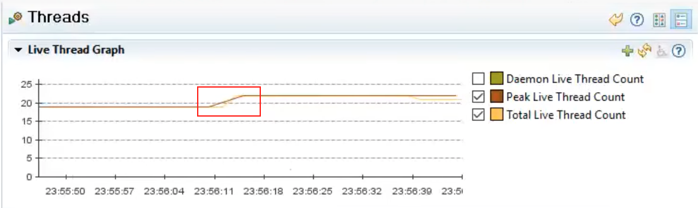

### Spring WebFlux Series - 11

우리는 [이전 장(링크)](https://imprint.tistory.com/238) 에서 링크드인의 발표자료를 보면서 서비스간의 통신으로 인한 블로킹 현상에 대해서 알아보았다.
이번 장 에서는 이러한 블록킹 문제를 해결하기 위한 방법에 대해서 알아본다.
모든 코드는 [깃 허브 (링크)](https://github.com/roy-zz/webflux)의 테스트 코드에 있으므로 필요하다면 참고하도록 한다.

---

### 원격지 서비스 추가

#### HTTP Client 코드 개선

`MvcV2Client` 코드는 `MvcClient` 코드에 `CyclicBarrier`를 추가하여 스레드 동기화를 구현해두었다.
이번에 추가되는 `MyClient`는 `MvcV2Client`의 요청 URL에 index값을 추가하도록 수정하고 리턴값을 출력하도록 수정하였다.

**MyClient**
```java
@Slf4j
@EnableAsync
public class MyClient {
    private static final AtomicInteger idx = new AtomicInteger(0);
    public static void main(String[] args) throws InterruptedException, BrokenBarrierException {
        ExecutorService es = Executors.newFixedThreadPool(1000);
        RestTemplate rt = new RestTemplate();
        String url = "http://localhost:8080/my-service/rest/{idx}";
        CyclicBarrier barrier = new CyclicBarrier(101);
        for (int i = 0; i < 100; i++) {
            es.submit(() -> {
                int index = idx.addAndGet(1);
                barrier.await();
                log.info("Thread {}", index);
                StopWatch sw = new StopWatch();
                sw.start();
                String response = rt.getForObject(url, String.class, index);
                sw.stop();
                log.info("Elapsed: {} {} / {}", index, sw.getTotalTimeSeconds(), response);
                return null;
            });
        }
        barrier.await();
        StopWatch main = new StopWatch();
        main.start();
        es.shutdown();
        es.awaitTermination(100, TimeUnit.SECONDS);
        main.stop();
        log.info("Total: {}", main.getTotalTimeSeconds());
    }
}
```

---

#### MyService Controller 개선

기존의 컨트롤러 코드를 개선한 `/mvc/rest API`도 `MyService` 로 개선하고 Path Variable을 받을 수 있도록 개선하였다.

```java
@SpringBootApplication
public class MyService {
    private static final RestTemplate REST_TEMPLATE = new RestTemplate();
    @RestController
    public static class MyController {
        @GetMapping("/my-service/rest/{idx}")
        public String service(@PathVariable String idx) {
            return idx;
        }
    }

    public static void main(String[] args) {
        SpringApplication.run(MyService.class, args);
    }
}
```

`MyClient`를 실행시켜서 부하테스트를 진행해본다.


크게 변경된 것은 없지만 이제 요청값과 반환값이 매칭된다는 사실을 알 수 있다.

---

#### RemoteService(원격지 서버) 추가

원격지 서버 역할을 하는 `RemoteService` 라는 클래스 파일을 추가하였고 `MyService`와 같은 경로에 위치한다.


`RemoteService`의 코드를 살펴본다.
`MyService`와 유사하게 SpringBoot에 의해 기동된다. 문제는 하나의 프로젝트 안에 application.yml을 공유하는 두 개의 서비스가 존재한다는 점이다.
만약 우리가 따로 지정하지 않는다면 `MyService`도 8080 포트를 사용하려 할 것이며 `RemoteService`고 8080 포트를 사용하려 할 것이다.
이러한 문제를 해결하기 위해 `RemoteService`의 경우 메인 메서드에 따로 설정값을 지정하여 `MyService`와는 다른 설정값을 가지도록 구현하였다.

**RemoteService**
```java
@SpringBootApplication
public class RemoteService {
    @RestController
    public static class RemoteController {
        @GetMapping("/remote-service/{request}")
        public String service(@PathVariable String request) {
            return request;
        }
    }
    public static void main(String[] args) {
        System.setProperty("server.port", "8081");
        System.setProperty("server.tomcat.max-threads", "1000");
        SpringApplication.run(RemoteService.class, args);
    }
}
```

`MyService` 또한 바로 반환값을 응답하는 것이 아니라 원격지 서버인 `RemoteService`의 `/remote-service/{request}` API를 호출하고 반환받은 응답 값을 응답하도록 수정하였다.

**MyService**

```java
@SpringBootApplication
public class MyService {
    private static final RestTemplate REST_TEMPLATE = new RestTemplate();
    @RestController
    public static class MyController {
        @GetMapping("/my-service/rest/{idx}")
        public String service(@PathVariable String idx) {
            String response = REST_TEMPLATE.getForObject("http://localhost:8081/remote-service/{request}", String.class, idx);
            return String.format("my-response: %s, remote-response: %s", idx, response);
        }
    }
    public static void main(String[] args) {
        SpringApplication.run(MyService.class, args);
    }
}
```

정상적으로 작동하는지 `MyClient`를 실행시켜서 출력을 확인해본다.


우리가 원하는대로 원격지 서버의 응답까지 포함되었으며 `MyService`에서 바로 반환하는 것보다 시간이 조금 더 걸린 것을 확인할 수 있다.
우리의 `RemoteService`는 데이터를 반환할 때 어떠한 작업도 하지않고 단순히 입력받은 값을 반환하고 있다.
하지만 실제 서비스에서 하나의 PC 내부에서 통신하는 일은 없으며 로직없이 바로 반환되는 경우는 더욱없다.
아래에서는 `RemoteService`를 조금 더 현실적인 서비스로 만들어보고 테스트를 진행한다.

---

#### RemoteService(원격지 서버) 연동 

`RemoteServer`의 코드를 수정하여 기존보다 sleep을 2초를 주어 작업을 처리하는데 2초의 시간이 소요되는 것 같은 효과를 준다.

```java
@SpringBootApplication
public class RemoteService {
    @RestController
    public static class RemoteController {
        @GetMapping("/remote-service/{request}")
        public String service(@PathVariable String request) throws InterruptedException {
            TimeUnit.SECONDS.sleep(2);
            return request;
        }
    }
    public static void main(String[] args) {
        System.setProperty("server.port", "8081");
        System.setProperty("server.tomcat.max-threads", "1000");
        SpringApplication.run(RemoteService.class, args);
    }
}
```

코드가 이렇게 작성되면 우리의 `MyService`는 `RemoteService`를 요청하고 2초를 대기해야하며 실제로 외부 서비스를 요청하고 대기하는 것과 비슷한 상황이 연출되었다.
참고로 `RestTemplate의 getForObject` 메서드는 블록킹 메서드로 `RemoteService`각 응답할 때까지 대기하고 다른 작업을 하지않고 대기하고 있는다.
또한 우리는 `MyService`의 톰캣 스레드를 1개로 지정하였기 때문에 하나의 스레드가 `getForObject`의 응답 값을 기다리는 동안 다른 스레드는 클라이언트의 요청을 처리할 방법이 없다.

이러한 상황에서 어떻게 작동하는지 출력을 확인해본다.


우리가 예상한 것처럼 요청들이 순서대로 처리되고 하나의 요청이 처리되는데 2초가 걸렸으니 100개의 요청이 처리되는데 200초가 넘는 시간이 소요되었다. 
결과가 이렇게 나왔다고 해서 우리의 `MyService` 자체에 리소스가 부족하다거나 이러한 문제가 있는 것은 아니며 단순히 리소스를 효율적으로 사용하지 못하는 상황이다.

---

### MyService 개선

우리는 바로 위에서 원격지 서버인 `RemoteService`를 연동하였다.
`RemoteService`의 API를 호출하는 `MyService`의 톰캣 스레드는 총 한 개였고 이로인해 하나의 요청을 처리할 때 다른 요청들이 전부 지연되는 블록킹 현상이 발생되었다.
이번에는 이러한 문제를 해결하기 위해 `MyService`를 비동기 방식으로 개선해본다.

물론 `스프링 3.*`대의 버전에서는 간단한 방법으로는 해결하지 못하였다.
`스프링 3.*`대의 버전에서는 이전 장에서 살펴본 `DeferredResult`와 `Callable`을 사용해서 처리해야하는데 `DeferredResult`는 외부의 이벤트가 발생해야하며 `Callable`은 백그라운드에서 작업할 작업 스레드를 따로 만들어야하기 때문에 구현이 쉽지않다.
작업 스레드를 생성해서 처리하는 경우 이전 장에서 발생한 문제처럼 `서블릿 스레드`는 반환되지만 `작업 스레드`는 요청수만큼 생성되어 처리되는 문제가 발생할 수 있다.

이런 경우를 위해서 블록킹 방식의 `RestTemplate`의 비동기 버전인 `AsyncRestTemplate`이 스프링 4.0 버전에서 등장하였다. (유감스럽게도 스프링 5.0에서 Deprecated 처리되었다.)
`AsyncRestTemplate`은 getForObject가 아닌 getForEntity 메서드를 사용하여 결과값을 반환받아야 한다.
구현체를 살펴보면 아래와 같다.

```java
@Deprecated
public class AsyncRestTemplate extends org.springframework.http.client.support.InterceptingAsyncHttpAccessor
        implements AsyncRestOperations {
    private final RestTemplate syncTemplate;
	// 생략...
    @Override
	public <T> ListenableFuture<ResponseEntity<T>> getForEntity(String url, Class<T> responseType, Object... uriVariables) throws RestClientException {
		AsyncRequestCallback requestCallback = acceptHeaderRequestCallback(responseType);
		ResponseExtractor<ResponseEntity<T>> responseExtractor = responseEntityExtractor(responseType);
		return execute(url, HttpMethod.GET, requestCallback, responseExtractor, uriVariables);
	}
	@Override
	public <T> ListenableFuture<ResponseEntity<T>> getForEntity(String url, Class<T> responseType, Map<String, ?> uriVariables) throws RestClientException {
		AsyncRequestCallback requestCallback = acceptHeaderRequestCallback(responseType);
		ResponseExtractor<ResponseEntity<T>> responseExtractor = responseEntityExtractor(responseType);
		return execute(url, HttpMethod.GET, requestCallback, responseExtractor, uriVariables);
	}
	@Override
	public <T> ListenableFuture<ResponseEntity<T>> getForEntity(URI url, Class<T> responseType) throws RestClientException {
		AsyncRequestCallback requestCallback = acceptHeaderRequestCallback(responseType);
		ResponseExtractor<ResponseEntity<T>> responseExtractor = responseEntityExtractor(responseType);
		return execute(url, HttpMethod.GET, requestCallback, responseExtractor);
	}
    // 생략...
}
```

우리가 기대한 반환 타입은 ResponseEntity이지만 실제 반환타입은 우리가 이전 장에서 살펴본 `ListenableFuture`다.
`RestTemplate`의 getForObject 메서드는 단순히 바디의 정보만 반환을 했지만 `AsyncRestTemplate`의 반환 타입인 ResponseEntity는 HTTP 응답 중에서 응답 코드, 헤더, 바디 세가지 정보를 모두 가지고 있다.
`ListenableFuture`는 비동기 작업에 대한 반환 결과를 가져올 수 있는 `Future` 타입이며 특징으로는 성공했을 때와 실패했을 때의 Callback 메서드를 등록할 수 있다는 점이다.

```java
@Slf4j
@EnableAsync
@SpringBootApplication
public class MyService {
    @RestController
    public static class MyController {
        private AsyncRestTemplate asyncRestTemplate = new AsyncRestTemplate();
        // 생략...
        @GetMapping("/my-service/async-rest/{idx}")
        public ListenableFuture<ResponseEntity<String>> asyncService(@PathVariable String idx) {
            return asyncRestTemplate.getForEntity("http://localhost:8081/remote-service/{request}", String.class, idx);
        }
    }
    // 생략...
}
```

`AsyncRestTemplate`을 사용할 때 반환타입이 `ListenableFuture`라면 굳이 Callback을 등록하지 않고 바로 반환하면 된다.
스프링은 컨트롤러가 ListenableFuture를 반환하면 클라이언트에게 바로 반환하는 것이 아니라 스프링 MVC에서 Callback 메서드를 만들어서 등록한다.
요청의 결과가 날아오면 스프링은 ListenableFuture 객체가 아닌 ResponseEntity가 반환 타입이라고 판단하고 반환한다.

혹시라도 코드를 실행시켜 본 사람이 있다면 비동기로 작동하지 않는다는 사실을 알게 될 것이다.
토비님의 강의에서는 200초가 걸리던 요청을 2초정도에 끝내는 것으로 나오고 있다.
이미 5년 전 강의이기도 하고 필자가 사용하는 스프링 버전에서는 `AsyncRestTemplate`이 Deprecated 되어 있다.
출력 결과는 토비님의 강의 영상에서 복사하여 첨부하므로 실제로는 2초 정도 소요된다고 생각하고 넘어간다.~~(어짜피 사용하지 않을 기술에 더 이상의 디버깅은...)~~


위에서 살펴본 것과 같이 사용해도 적은 리소스로 많은 요청을 처리하기에는 큰 무리는 없다.
하지만 `JMC`를 사용하여 확인해보면 제약사항이 있다. 
~~(필자의 PC에서는 `AsyncRestTemplate`가 정상적으로 작동하지 않아서 첨부파일은 전부 강의영상의 이미지를 사용하였다.)~~


우리는 분명 톰캣 스레드를 1개로 제한하였지만 부하 테스트를 진행할 때 스레드의 수가 치솟는 현상을 볼 수 있다.
`AsyncResultTemplate`는 기본적으로 외부 API를 처리할 때 비동기로 처리하는 것은 맞다. 하지만 비동기 작업을 처리하기 위해서 백그라운드에 스레드를 만들어서 처리한다.
마치 스레드 하나로 모든 요청을 처리하는 것 같지만 톰캣 스레드만 1개로 유지될 뿐 실제로 요청을 처리할 때는 새로운 스레드를 생성해서 처리한다.
스레드를 새로 생성하는 것은 상당히 큰 비용을 지불해야하는데 요청이 들어올 때마다 새로운 스레드를 만드는 것은 굉장히 큰 비용이라고 할 수 있다. (이래서 Deprecated 처리 되었나보다.)

이러한 작동 방식은 우리가 원하던 작동 방식이 아니다.
우리는 요청을 처리하기 위해서 최소한의 자원만을 사용하기를 바랬지만 `AsyncResultTemplate`는 요청마다 스레드를 생성하는 방식으로 요청을 처리하였다.

---

### Netty

우리는 기본 `AsyncRestTemplate`을 사용하여 비동기로 작동하는 서비스를 구현하였지만 요청의 수만큼 스레드가 생기는 현상을 발견하였다.
이번에는 `AsyncRestTemplate` 객체를 생성할 때 `Netty4ClientHttpRequestFactory` 객체를 전달하고 사용할 수 있는 스레드를 1개로 제한하고 테스트를 진행해본다.
`Netty`의 경우 따로 설정하지 않는다면 기본적으로 프로세스의 갯수 * 2개의 스레드가 생성이 된다.
~~(이번에도 역시 필자의 자리에서 AsyncRestTemplate가 비동기로 작동하지 않아서 이미지는 참고한 강의의 이미지를 사용한다.)~~

```java
@Slf4j
@EnableAsync
@SpringBootApplication
public class MyService {
    @RestController
    public static class MyController {
        private AsyncRestTemplate nettyRestTemplate = new AsyncRestTemplate(new Netty4ClientHttpRequestFactory(
                new NioEventLoopGroup(1)
        ));
        // 생략...
        @GetMapping("/my-service/async-netty/{idx}")
        public ListenableFuture<ResponseEntity<String>> nettyService(@PathVariable String idx) {
            return nettyRestTemplate.getForEntity("http://localhost:8081/remote-service/{request}", String.class, idx);
        }
    }
}
```

클라이언트 역할을 하는 코드를 실행시켜서 테스트의 결과를 확인해본다.
우선 `AsyncRestTemplate`처럼 스레드를 생성해서 요청을 처리하지는 않는지 리소스 사용량을 확인해본다.



결과는 만족스럽다. 물론 요청을 처리하기 위해서 스레드가 생성된 것은 맞지만 요청수와 정비례하지는 않으며 5개정도의 스레드만 추가된 것을 확인할 수 있다.
요청을 처리하는데 소요된 시간을 확인해보더라도 일반 `AsyncRestTemplate`과 차이가 나지 않는 것을 확인할 수 있다.


스레드 현황을 확인해보면 톰캣 스레드인 `http-nio-8080-exec-1` 스레드가 하나있고 Netty의 스레드인 `nioEventLoopGroup`이 있는 것을 확인할 수 있다.


`AsyncRestTemplate`의 경우 스프링에서 만든 것이지만 `Java`의 Network API와 Concurrency 라이브러리만 잘 조합한다면 누구든지 같은 동작을 구현할 수 있다.
일부 기본적으로 비동기로 작동하는 `Node`를 사용하는 개발자들 `Spring`은 동기로 작동하여 요청이 많아지면 무조건 느려지더라 라는 얘기를 하는 경우 기죽을 필요없이 Java 및 Spring도 Node와 같이 비동기로 작동할 수 있다고 얘기해도 된다.

---

### DeferredResult

지금까지 `AsyncRestTemplate`과 `Netty`를 사용하여 비동기적으로 요청을 처리하는 방법에 대해서 알아보았다.
하지만 하나 불편한 점은 외부 서비스의 응답 결과를 가공할 수 없이 바로 클라이언트에게 전달해야한다는 점이다.
이러한 문제를 해결하기 위해 이전 장에서 잠깐 살펴보았던 `DeferredResult`가 사용된다.

`DeferredResult`를 사용하여 수정된 코드는 아래와 같다.

```java
@Slf4j
@EnableAsync
@SpringBootApplication
public class MyService {
    @RestController
    public static class MyController {
        private AsyncRestTemplate nettyRestTemplate = new AsyncRestTemplate(new Netty4ClientHttpRequestFactory(
                new NioEventLoopGroup(1)
        ));
        @GetMapping("/my-service/async-custom/{idx}")
        public DeferredResult<String> customAsyncService(@PathVariable String idx) {
            DeferredResult<String> deferredResult = new DeferredResult<>();
            ListenableFuture<ResponseEntity<String>> future = asyncRestTemplate.getForEntity(
                    "http://localhost:8081/remote-service/{request}", String.class, idx);
            future.addCallback(success -> {
                deferredResult.setResult(Objects.requireNonNull(success).getBody() + "/work");
            }, failure -> {
                deferredResult.setErrorResult(failure.getMessage());
            });
            return deferredResult;
        }
    }
}
```

`DeferredResult`를 반환하도록 코드를 구현하면 자바는 바로 `DeferredResult` 객체를 반환하는 것이아니라 언젠가 `DeferredResult`객체에 값이 입력되면 그때 값을 반환한다.
코드를 이렇게 작성하고 부하 테스트를 진행해본다.


이전에 부하 테스트를 진행했던 테스트 케이스들과 비슷한 결과가 나온것을 확인할 수 있다.

---

이번 장에서는 `AsyncRestTemplate`, `Netty`, `DeferredResult`를 사용해서 비동기 컨트롤러를 만드는 방법에 대해서 알아보았다.
다음 장에서는 외부 통신이 여러번 일어날 때 어떠한 방식으로 처리해야하는지에 대해서 알아본다.

---

**참고한 강의**

- https://www.youtube.com/watch?v=ExUfZkh7Puk