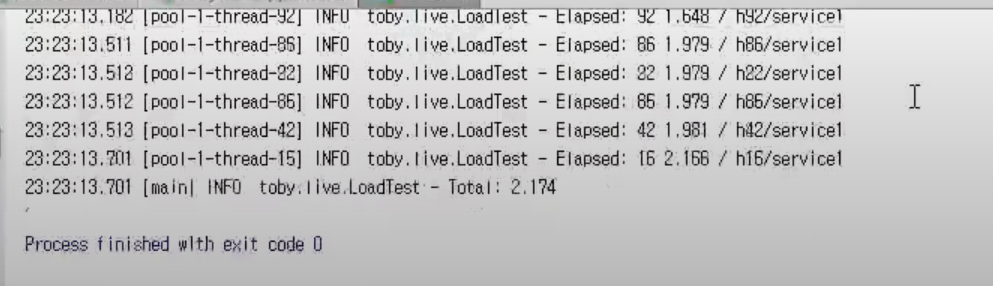
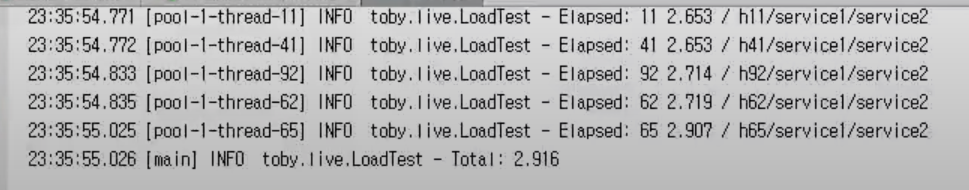
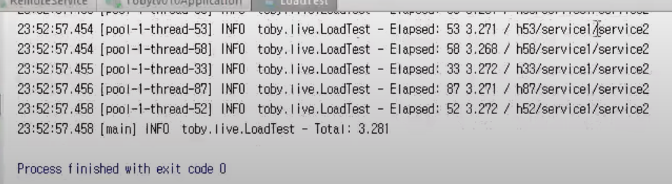
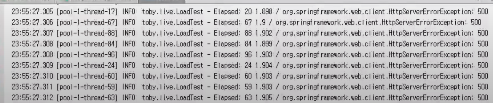
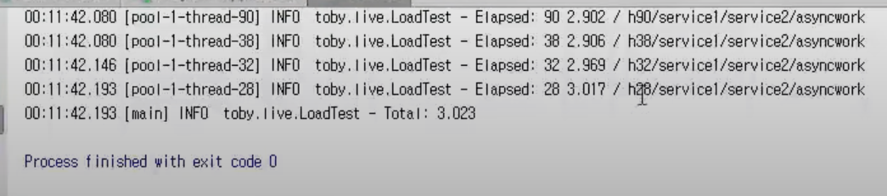

[이전 장(링크)](https://imprint.tistory.com/241) 에서는 `AsyncRestTemplate`과 `DeferredResult`를 통해서 외부 API를 호출할 때 발생하는 블록킹 문제를 해결하였다.
이번 장에서는 블록킹 문제를 해결하면서 등장한 `Callback Hell`이라는 문제를 해결해보도록 한다.
모든 코드는 [깃 허브 (링크)](https://github.com/roy-zz/webflux)의 테스트 코드에 있으므로 필요하다면 참고하도록 한다.

---

### 개요

이번 장에서는 이전에 작성한 코드에 새로운 기능을 추가하는 것이 아니라 `Callback Hell`을 해결하기 위하여 코드를 리펙토링 하는 시간을 가져볼 것이다.

```java
@GetMapping("/my-service/async-complex-with-logic/{idx}")
public DeferredResult<String> complexAsyncWithService(@PathVariable String idx) {
    DeferredResult<String> deferredResult = new DeferredResult<>();

    ListenableFuture<ResponseEntity<String>> future1 = nettyRestTemplate.getForEntity(
            "http://localhost:8081/remote-service-1/{request}", String.class, idx);
    future1.addCallback(success -> {
        ListenableFuture<ResponseEntity<String>> future2 = nettyRestTemplate.getForEntity(
                "http://localhost:8081/remote-service-2/{request}", String.class, Objects.requireNonNull(success).getBody());
        future2.addCallback(success2 -> {
            ListenableFuture<String> future3 = myLogic.work(Objects.requireNonNull(success2).getBody());
            future3.addCallback(success3 -> {
                deferredResult.setResult(success3);
            }, ex3 -> {
                deferredResult.setErrorResult(ex3.getMessage());
            });
        }, ex2 -> {
            deferredResult.setErrorResult(ex2.getMessage());
        });
    }, ex -> {
        deferredResult.setErrorResult(ex.getMessage());
    });
    return deferredResult;
}
```

우리는 이전에 요청마다 2초의 처리시간이 걸리는 두 개의 API를 호출하고 내부 서비스 로직까지 실행시켜서 반납하는 API를 생성하였다.
코드를 작성하는 과정에서 아래와 같이 연쇄적으로 작동하는 코드를 만들게 되었다.

`첫번째 API를 호출하고 성공` -> `두번째 API를 호출하고 성공` -> `서비스 로직 실행`

로직만 보면 간단해보일 수 있지만 실제로 코드를 살펴보면 무한 Callback 형식의 지저분한 코드라고 볼 수 있다.
또한 한 번의 Callback이 추가될 때마다 똑같은 형태의 예외처리 코드가 중복되고 있다.

우리가 기존에 작성한 코드를 확인해보면 Callback을 활용한 `명령형 코드`다. 
`함수형 코드`로 작성하면 우리가 작성한 코드와 다르게 복잡하지 않게 구현이 가능하다. 
자바8 이상을 사용하고 있다면 깔끔하게 정리가 가능하지만 자바8의 문법을 적용하기 전에 우리의 힘으로 코드를 작성하여 `Callback Hell`을 해결해본다.

---

### Refactoring

우리가 작성한 코드의 근본적인 문제는 우리가 결과값을 바로 쓸 수 있는 구조가 아니라 결과값을 가져올 수 있는 중개자 역할의 객체를 가져와서 `Callback 메서드`를 장착하는 구조라는 점이다. 
이번에는 비동기 작업 실행의 모든 과정을 담고 있는 클래스를 하나 만들어서 `Callback` 형식이 아니라 `Chaining` 형식으로 바뀔 수 있도록 구현해본다.

#### Version - 1

비동기 작업을 처리하고 ListenableFuture와 같은 객체를 가져와서 `Callback`으로 데이터를 넣는 작업이 있다고 가정해본다.
우리가 만드는 `Completion`이라는 클래스는 작업이 완료되거나 에러가 발생하였을 때 이러한 처리를 다시 한 번 재정의 해주기 위한 클래스라고 보면된다.
첫 번재 비동기 작업은 의존성이 앞에 어떤 작업에 의존하지 않기 때문에 파라미터 값 정도를 의존하는 것 말고는 의존성이 없다.
두 번째 비동기 작업 같은 경우는 사실 앞에 비동기 작업이 완료 및 성공을 하게 되면 그 때 정보를 받아서 작동하는 의존적인 비동기 작업이다.
세 번째 비동기도 두 번째 비동기 작업과 같은 구조라고 볼 수 있다.
`from`메서드에서 `Completion`을 반환할 때 `Callback`메서드를 처리하는 로직을 추가하였다.
`from`에 대한 결과를 두 번째에 이어서 `andAccept`에서 `Completion` 객체를 생성한다.
람다식 안에서 결과값을 변경가능 하도록 수정이 필요하다.
`andAccept`의 경우 다음에 추가적인 작업이 필요없으므로 리턴값은 `void`로 지정하였다.

`andAccept`는 `from`의 결과를 `andAccept`의 파라미터로 들어가있는 람다식에 전달하여 처리되도록 한다.
`andAccept`가 호출될 때 파라미터로 전달받은 `Consumer` 객체를 통해 새로운 `Completion` 객체를 생성하고 생성된 객체를 `next` 변수에 대입한다.

**호출부**
```java
@GetMapping("/callback-hell/resolve/v1/{idx}")
public DeferredResult<String> callbackHellResolveV1(@PathVariable int idx) {
    DeferredResult<String> dr = new DeferredResult<>();
    CompletionV1
            .from(rt.getForEntity(URL_1, String.class, "v1_" + idx))
            .andAccept(success -> dr.setResult(success.getBody()));
    return dr;
}
```

**CompletionV1**
```java
@NoArgsConstructor
public class CompletionV1 {
    private CompletionV1 next;
    private Consumer<ResponseEntity<String>> consumer;
    public CompletionV1(Consumer<ResponseEntity<String>> consumer) {
        this.consumer = consumer;
    }
    public static CompletionV1 from(ListenableFuture<ResponseEntity<String>> lf) {
        CompletionV1 completionV1 = new CompletionV1();
        lf.addCallback(completionV1::complete, completionV1::error);
        return completionV1;
    }
    public void andAccept(Consumer<ResponseEntity<String>> consumer) {
        this.next = new CompletionV1(consumer);
    }
    private void complete(ResponseEntity<String> success) {
        if (Objects.nonNull(next)) {
            next.run(success);
        }
    }
    private void run(ResponseEntity<String> success) {
        if (Objects.nonNull(consumer)) {
            consumer.accept(success);
        }
    }
    private void error(Throwable failure) {}
}
```

`andAccept`를 통해서 하나의 `Callback` 메서드만 전달하여 호출해본다. 
~~(이번 예제 또한 필자의 스프링 버전에서 비동기로 작동하지 않는 현상이 발생하여 첨부하는 이미지를 영상의 출력값으로 대체한다.)~~
출력된 결과는 아래와 같이 2초 정도 시간이 소요되었고 우리가 예상한 결과가 출력된 것을 확인할 수 있다.



---

#### Version - 2

이번에는 Completion 객체를 추가하여 한 번에 두 개를 `Chaining`하여 2단 `Callback` 구조를 `Chaining` 구조로 변경해본다.
`andApply` 메서드를 추가하여 중간에 `Callback` 메서드를 하나 추가하였다.
`Function`이 추가되면서 `run` 메서드도 변경이 필요해졌다.
기존에 `consumer`의 유무를 확인하고 로직을 실행시켰지만 `function`이 추가되면서 `function`이 존재하는 경우에 대한 처리까지 필요해졌다.
만약 `function`이 `null`이 아니라면 `function`의 `apply`를 호출하여 백그라운드에서 API 호출과 같은 작업들이 수행되고 결과를 `ListenableFuture`로 반환되게 하였다.
반환된 `ListenableFuture`는 `apply`의 결과가 성공인 경우 자기 자신의 `complete` 메서드를 호출하고 실패한 경우 자기 자신의 `error` 메서드를 호출한다.
`andApply`와 `andAccept`의 가장 큰 차이는 작업의 완료와 과정의 차이라고 할 수 있다.
`andApply`는 자신을 적용한 이후에 다음 `Completion` 객체를 연결시켜 다음 작업을 진행할 수 있도록 해야한다.
`andAccept`는 자신이 호출되면서 작업이 완료되므로 다음 `Completion`객체를 연결할 필요가 없다.
`Builder`와 비교하면 필드명으로 필드의 값을 입력하여 `builder`객체를 반환하는 것은 `andApply`라고 할 수 있고 `build()`메서드를 호출하여 우리가 생성하고자하는 객체를 생성하는 단계를 `andAccept`라고 할 수 있다.

**호출부**
```java
@GetMapping("/callback-hell/resolve/v2/{idx}")
public DeferredResult<String> callbackHellResolveV2(@PathVariable int idx) {
    DeferredResult<String> dr = new DeferredResult<>();
    CompletionV2
            .from(rt.getForEntity(URL_1, String.class, "v2_" + idx))
            .andApply(success -> rt.getForEntity(URL_2, String.class, success.getBody()))
            .andAccept(success -> dr.setResult(success.getBody()));
    return dr;
}
```

**CompletionV2**
```java
@NoArgsConstructor
public class CompletionV2 {
    private CompletionV2 next;
    private Consumer<ResponseEntity<String>> consumer;
    public CompletionV2(Consumer<ResponseEntity<String>> consumer) {
        this.consumer = consumer;
    }
    private Function<ResponseEntity<String>, ListenableFuture<ResponseEntity<String>>> function;
    public CompletionV2(Function<ResponseEntity<String>, ListenableFuture<ResponseEntity<String>>> function) {
        this.function = function;
    }
    public static CompletionV2 from(ListenableFuture<ResponseEntity<String>> lf) {
        CompletionV2 completionV2 = new CompletionV2();
        lf.addCallback(completionV2::complete, completionV2::error);
        return completionV2;
    }
    public void andAccept(Consumer<ResponseEntity<String>> consumer) {
        this.next = new CompletionV2(consumer);
    }
    public CompletionV2 andApply(Function<ResponseEntity<String>, ListenableFuture<ResponseEntity<String>>> function) {
        CompletionV2 completionV2 = new CompletionV2(function);
        this.next = completionV2;
        return completionV2;
    }
    private void complete(ResponseEntity<String> success) {
        if (Objects.nonNull(next)) {
            next.run(success);
        }
    }
    private void run(ResponseEntity<String> success) {
        if (Objects.nonNull(consumer)) {
            consumer.accept(success);
        } else if (Objects.nonNull(function)) {
            ListenableFuture<ResponseEntity<String>> lf = function.apply(success);
            lf.addCallback(this::complete, this::error);
        }
    }
    private void error(Throwable failure) {}
}
```

`andApply`를 추가한 코드를 실행하여 출력되는 결과를 확인해보면 우리가 예상한대로 결과가 출력되는 것을 확인할 수 있다.



여기서 `CompletionV2` 클래스에서 `run`메서드를 확인해보면 객체가 생성되고 실행되는 시점에 필드의 값을 확인하여 어떠한 용도록 사용되는 객체인지 if문을 사용하여 구분하고 있다.
이러한 코드는 리펙토링이 필요한 코드로 판단되며 용도에 따라서 `AsyncCompletion`과 `AcceptCompletion` 두 개의 객체로 구분하여 다형성을 적용시켜 본다.

---

#### Version - 3

`CompletionV3` 클래스에 `CompletionV3`를 상속받는 내부 클래스인 `AcceptCompletion`과 `AsyncCompletion`을 구현하였다.
다형성 적용이 필요한 `run` 메서드를 아래와 같이 수정하였다.
코드를 살펴보면 기존에 하나의 `run` 메서드에서 분기처리가 되던 코드를 두 개의 클래스로 나누어 다형성을 적용시킨 것을 확인할 수 있다.
`Version - 3`는 기능적으로 변경된 부분은 없으며 공통된 부분은 하나로 추출하고 다형성을 적용시킬 수 있는 부분에 다형성을 적용시켜 쉽게 확장시킬 수 있도록 변경하였다.

**호출부**
```java
@GetMapping("/callback-hell/resolve/v3/{idx}")
public DeferredResult<String> callbackHellResolveV3(@PathVariable int idx) {
    DeferredResult<String> dr = new DeferredResult<>();
    CompletionV3
            .from(rt.getForEntity(URL_1, String.class, "v3_" + idx))
            .andApply(success -> rt.getForEntity(URL_2, String.class, success.getBody()))
            .andAccept(success -> dr.setResult(success.getBody()));
    return dr;
}
```

**CompletionV3**
```java
@NoArgsConstructor
public class CompletionV3 {
    private CompletionV3 next;
    public static CompletionV3 from(ListenableFuture<ResponseEntity<String>> lf) {
        CompletionV3 completionV3 = new CompletionV3();
        lf.addCallback(completionV3::complete, completionV3::error);
        return completionV3;
    }
    public void andAccept(Consumer<ResponseEntity<String>> consumer) {
        this.next = new AcceptCompletion(consumer);
    }
    public CompletionV3 andApply(Function<ResponseEntity<String>, ListenableFuture<ResponseEntity<String>>> function) {
        CompletionV3 completionV3 = new ApplyCompletion(function);
        this.next = completionV3;
        return completionV3;
    }
    public void run(ResponseEntity<String> value) {}
    protected void complete(ResponseEntity<String> success) {
        if (Objects.nonNull(next)) {
            next.run(success);
        }
    }
    protected void error(Throwable failure) {}
    public static class AcceptCompletion extends CompletionV3 {
        private Consumer<ResponseEntity<String>> consumer;
        public AcceptCompletion(Consumer<ResponseEntity<String>> consumer) {
            this.consumer = consumer;
        }
        @Override
        public void run(ResponseEntity<String> value) {
            consumer.accept(value);
        }
    }
    public static class ApplyCompletion extends CompletionV3 {
        private Function<ResponseEntity<String>, ListenableFuture<ResponseEntity<String>>> function;
        public ApplyCompletion(Function<ResponseEntity<String>, ListenableFuture<ResponseEntity<String>>> function) {
            this.function = function;
        }
        @Override
        public void run(ResponseEntity<String> value) {
            ListenableFuture<ResponseEntity<String>> lf = function.apply(value);
            lf.addCallback(this::complete, this::error);
        }
    }
}
```

---

#### Version - 4

`Version - 4`에서는 에러 처리가 중복으로 표시되는 문제를 해결해본다.
여기서 에러 처리가 중복된다는 것은 `Callback 지옥의 코드`와 같이 비동기 처리가 진행될 때 마다 동일한 에러처리 코드가 계속 중복되어 사용된다는 점이다.
에러 처리는 전체의 흐름에서 단 한번만 처리하도록 `Version - 4`의 클래스 코드를 생성해본다.

**호출부**
```java
@GetMapping("/callback-hell/resolve/v4/{idx}")
public DeferredResult<String> callbackHellResolveV4(@PathVariable int idx) {
    DeferredResult<String> dr = new DeferredResult<>();
    CompletionV4
            .from(rt.getForEntity(URL_1, String.class, "v4_" + idx))
            .andApply(success -> rt.getForEntity(URL_2, String.class, success.getBody()))
            .andError(dr::setErrorResult)
            .andAccept(success -> dr.setResult(success.getBody()));
    return dr;
}
```

`CompletionV4`를 사용하는 코드를 확인해보면 1번 비동기 작업인 `from`이 있고 2번 비동기 작업인 `andApply`가 있다.
우리는 두 개 중 하나에서 오류가 발생하더라도 `andError`의 매개변수로 입력된 `function`이 실행되도록 구현할 것이다.
또한 예외가 발생하는 경우 이후의 작업인 `andAccept`는 실행되지 않아야하며 예외가 발생하지 않는 경우 정상적으로 `andAccept`가 호출되어야 한다.

**CompletionV4**
```java
public class CompletionV4 {
    protected CompletionV4 next;
    public static CompletionV4 from(ListenableFuture<ResponseEntity<String>> lf) {
        CompletionV4 completionV4 = new CompletionV4();
        lf.addCallback(completionV4::complete, completionV4::error);
        return completionV4;
    }
    public CompletionV4 andError(Consumer<Throwable> errConsumer) {
        CompletionV4 completionV4 = new ErrorCompletion(errConsumer);
        this.next = completionV4;
        return completionV4;
    }
    public void andAccept(Consumer<ResponseEntity<String>> consumer) {
        this.next = new CompletionV4.AcceptCompletion(consumer);
    }
    public CompletionV4 andApply(Function<ResponseEntity<String>, ListenableFuture<ResponseEntity<String>>> function) {
        CompletionV4 completionV4 = new CompletionV4.ApplyCompletion(function);
        this.next = completionV4;
        return completionV4;
    }
    public void run(ResponseEntity<String> value) {}
    protected void complete(ResponseEntity<String> success) {
        if (Objects.nonNull(next)) {
            next.run(success);
        }
    }
    protected void error(Throwable throwable) {
        if (Objects.nonNull(next)) {
            next.error(throwable);
        }
    }
    public static class ErrorCompletion extends CompletionV4 {
        public Consumer<Throwable> errConsumer;
        public ErrorCompletion(Consumer<Throwable> errConsumer) {
            this.errConsumer = errConsumer;
        }
        @Override
        public void run(ResponseEntity<String> value) {
            if (Objects.nonNull(next)) {
                next.run(value);
            }
        }
        @Override
        public void error(Throwable e) {
            errConsumer.accept(e);
        }
    }
    public static class AcceptCompletion extends CompletionV4 {
        private Consumer<ResponseEntity<String>> consumer;
        public AcceptCompletion(Consumer<ResponseEntity<String>> consumer) {
            this.consumer = consumer;
        }
        @Override
        public void run(ResponseEntity<String> value) {
            consumer.accept(value);
        }
    }
    public static class ApplyCompletion extends CompletionV4 {
        private Function<ResponseEntity<String>, ListenableFuture<ResponseEntity<String>>> function;
        public ApplyCompletion(Function<ResponseEntity<String>, ListenableFuture<ResponseEntity<String>>> function) {
            this.function = function;
        }
        @Override
        public void run(ResponseEntity<String> value) {
            ListenableFuture<ResponseEntity<String>> lf = function.apply(value);
            lf.addCallback(this::complete, this::error);
        }
    }
}
```

`CompletionV4`의 `onError` 메서드를 살펴보면 계속 `next`객체의 `onError` 메서드로 예외를 전달한다.
그러다가 `ErrorCompletion` 객체를 만나면 `@Override`된 `onError` 메서드가 호출되어 더 이상 에러가 전달되지 않고 처리되도록 구현되었다.
우리가 예상하는 대로 코드가 정상작동 하는지 테스트를 진행해본다.



다음으로 `from` 부분에서 에러가 발생하도록 코드를 수정하고 `andAccept`가 호출되지 않는 것을 확인해본다.
출력 결과를 확인해보면 우리의 예상과 같이 `andAccept`가 호출되지 않고 에러 메시지가 반환되는 것을 확인할 수 있다.



---

#### Version - 5

마지막으로 `Version - 5` 버전은 외부 API를 호출하는 코드뿐만 아니라 내부 로직인 MyLogic을 호출하는 부분도 동일한 방법으로 처리한다.
`Version - 5`버전을 적용할 때 컨트롤러 코드는 기존 버전들과 동일하게 `andApply`만 추가로 연결하면 된다.
하지만 MyLogic의 `work` 메서드의 반환 타입이 `String`이므로 `CompletionV5`에 제네릭을 적용시켜야 한다.

**호출부**
```java
@GetMapping("/callback-hell/resolve/v5/{idx}")
public DeferredResult<String> callbackHellResolveV5(@PathVariable int idx) {
    DeferredResult<String> dr = new DeferredResult<>();
    CompletionV5
            .from(rt.getForEntity(URL_1, String.class, "v5_" + idx))
            .andApply(success -> rt.getForEntity(URL_2, String.class, success.getBody()))
            .andApply(success -> myLogic.work(success.getBody()))
            .andError(dr::setErrorResult)
            .andAccept(dr::setResult);
    return dr;
}
```

**CompletionV5**
```java
public class CompletionV5<S, T> {
    protected CompletionV5 next;
    public void andAccept(Consumer<T> consumer) {
        this.next = new AcceptCompletion<>(consumer);
    }
    public static <S, T> CompletionV5<S, T> from(ListenableFuture<T> lf) {
        CompletionV5<S, T> completionV5 = new CompletionV5<>();
        lf.addCallback(completionV5::complete, completionV5::error);
        return completionV5;
    }
    public CompletionV5<T, T> andError(Consumer<Throwable> errConsumer) {
        CompletionV5<T, T> completionV5 = new ErrorCompletion<>(errConsumer);
        this.next = completionV5;
        return completionV5;
    }
    public <V> CompletionV5<T, V> andApply(Function<T, ListenableFuture<V>> function) {
        CompletionV5<T, V> completionV5 = new ApplyCompletion<>(function);
        this.next = completionV5;
        return completionV5;
    }
    public void run(S value) {}
    protected void complete(T success) {
        if (Objects.nonNull(next)) {
            next.run(success);
        }
    }
    protected void error(Throwable throwable) {
        if (Objects.nonNull(next)) {
            next.error(throwable);
        }
    }
    public static class ErrorCompletion<T> extends CompletionV5<T, T> {
        public Consumer<Throwable> errConsumer;
        public ErrorCompletion(Consumer<Throwable> errConsumer) {
            this.errConsumer = errConsumer;
        }
        @Override
        public void run(T value) {
            if (Objects.nonNull(next)) {
                next.run(value);
            }
        }
        @Override
        public void error(Throwable e) {
            errConsumer.accept(e);
        }
    }
    public static class AcceptCompletion<S> extends CompletionV5<S, Void> {
        private Consumer<S> consumer;
        public AcceptCompletion(Consumer<S> consumer) {
            this.consumer = consumer;
        }
        @Override
        public void run(S value) {
            consumer.accept(value);
        }

    }
    public static class ApplyCompletion<S, T> extends CompletionV5<S, T> {
        private Function<S, ListenableFuture<T>> function;
        public ApplyCompletion(Function<S, ListenableFuture<T>> function) {
            this.function = function;
        }
        @Override
        public void run(S value) {
            ListenableFuture<T> lf = function.apply(value);
            lf.addCallback(this::complete, this::error);
        }
    }
}
```

제네릭을 적용시켰다면 결과가 정상적으로 출력되는지 결과를 확인해보도록 한다.



우리가 예상한 것과 동일한 결과가 출력되는 것을 확인할 수 있다.

---

이번 장에서는 `Callback 지옥` 코드를 해결하는 방법에 대해서 알아보았다.
리펙토링 결과 이전의 `Callback 지옥` 코드와는 다르게 상당히 간소화된 코드를 확인할 수 있었다.

---

#### 참고

`Function` 인터페이스의 `compose`는 다른 메서드를 실행할 수 있도록 해준다.
`andThen`을 현재 `Function`의 `apply`을 실행하고 다음 `Function`의 `apply`를 실행할 수 있도록 한다.
`andAccept`라는 것은 `Consumer` 인터페이스를 구현한 람다식을 만들면 `Accept`하나만 구현하게 된다.

---

**참고한 강의**

- https://www.youtube.com/watch?v=Tb43EyWTSlQ&ab_channel=TobyLee