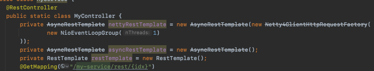
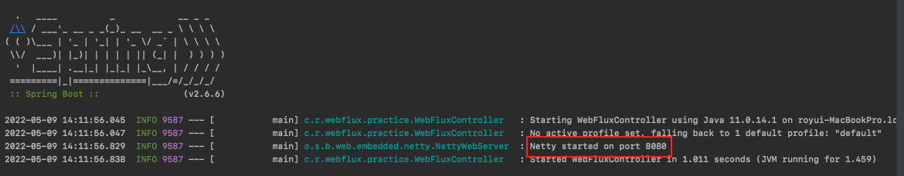
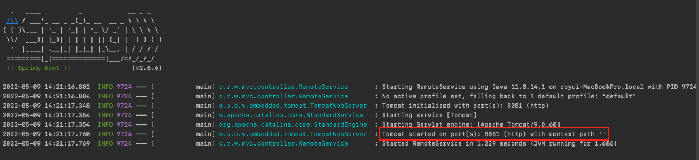
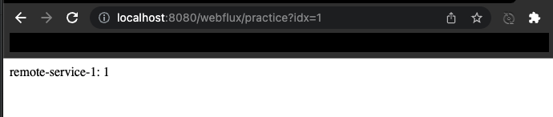
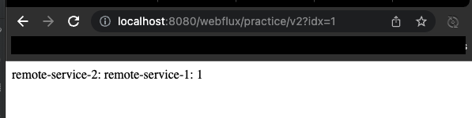
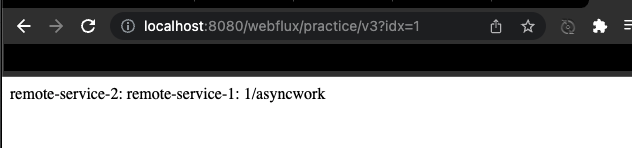
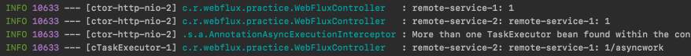

### Spring WebFlux Series - 15

[이전 장(링크)](https://imprint.tistory.com/245?category=1067652) 에서는 `Completable Future`에 대해서 알아보았다.
이번 장에서는 드디어 `WebFlux`에 대해서 알아본다.
모든 코드는 [깃 허브 (링크)](https://github.com/roy-zz/webflux) 의 테스트 코드에 있으므로 필요하다면 참고하도록 한다.

---

### 개요

기존에 작성한 코드를 살펴보면 비동기로 API를 호출하는 `AsyncRestTemplate`이 Spring의 버전이 올라가면서 `Deprecated`처리 된 것을 확인할 수 있다.



기능은 정상적으로 작동하지만 `스프링 5.*`에서 지원하는 `Reactive` 스타일이 아니다. 기본적으로 `ListenableFuture`를 반환하며 따로 `callback` 메서드를 지정해주어야 하기 때문이다.
또한 `AsyncRestTemplate`를 대체하는 `WebClient`라는 라이브러리가 출시되었기 때문이다.
`WebClient`는 `AsyncRestTemplate`과 동일하게 비동기 논블록킹 방식으로 동작하면서 `Reactive` 방식의 프로그래밍도 지원한다.

---

### WebFlux

`WebFlux`라고하는 스프링의 웹 기술 스택은 기존에 없었던 `함수형 프로그래밍` 방식으로 작성이 가능하다.
`DeferredResult`라는 기존의 반환타입에서 `Mono` 또는 `Flux`라는 타입으로 변경해야한다.
`Mono`는 데이터를 기존에 `DeferredResult`를 사용하거나 단순히 데이터를 반환하는 방식으로 어떠한 오브젝트라도 반환이 가능하다.

이미 결과가 완성되어 있는 값을 반환하고 싶다면 `Mono.just(...)`를 사용하여 값을 반환하면 된다.

```java
@RestController
public class WebFluxController {
    @GetMapping("/webflux/practice")
    public Mono<String> rest(int idx) {
        return Mono.just("Hello");
    }
}
```

`Mono`를 간단하게 `List`나 `Optional`처럼 값을 담는 컨테이너라고 생각하면 되며 하나 이상의 값이 들어갈 수 있다.
`List`, `Optional`과 같은 컨테이너를 사용하는 경우의 장점은 컨테이너가 제공하는 기능을 사용할 수 있다는 점이다.
`스프링 5.*` 이상의 `Reactive Web`에서 값을 반환할 때는 `Mono`나 `Flux`를 사용해야한다.
물론 사용하지 않고 반환할 수는 있지만 호환성을 위해서 `Mono`와 `Flux`를 사용하는데 적응하는 것이 좋다.

```java
@Slf4j
@RestController
@SpringBootApplication
public class WebFluxController {
    @Bean
    NettyReactiveWebServerFactory nettyReactiveWebServerFactory() {
        return new NettyReactiveWebServerFactory();
    }
    @GetMapping("/webflux/practice")
    public Mono<String> rest(int idx) {
        return Mono.just("Hello");
    }
    public static void main(String[] args) {
        System.setProperty("reactor.ipc.netty.workerCount", "2");
        System.setProperty("reactor.ipc.netty.pool.maxConnections", "2000");
        SpringApplication.run(WebFluxController.class, args);
    }

}
```

새로 작성한 컨트롤러를 실행시켜 출력되는 결과를 확인해본다.



우리가 스프링 빈으로 `NettyReactiveWebServerFactory`를 등록하였기 때문에 `Embedded Netty`가 사용된 것을 확인할 수 있다.
`스프링 5.*`는 더 이상 서블릿 기반이 아니기 때문에 `Tomcat`과 같은 서블릿 컨테이너에 의존적이지 않다.
`Tomcat`, `Jetty`, `Undertow`, `Netty`와 같은 서비스들을 선택적으로 사용할 수 있으며 여기서 `Undertow`와 `Netty`는 서블릿이 아니라 Http 서비스 라이브러리라고 볼 수 있지만 사용이 가능하다.

기존에 사용하던 `Remote Service`는 기존과 동일하게 톰캣을 사용할 수 있도록 아래와 같이 `TomcatReactiveWebServerFactory`를 빈으로 등록하는 코드를 추가한다.

```java
@SpringBootApplication
public class RemoteService {
    @Bean
    TomcatReactiveWebServerFactory tomcatReactiveWebServerFactory() {
        return new TomcatReactiveWebServerFactory();
    }
    // 이하 생략...
}
```



우리가 원하는 것처럼 `Tomcat`이 사용된 것을 확인할 수 있다.
`Tomcat`과 관련된 라이브러리가 있다면 `Netty`보다 우선된다.

---

### 실습

아래와 같이 `WebClient`를 사용하여 `Mono`로 감싸진 `ClientResponse`를 반환받는 코드를 작성해본다.

```java
private WebClient client = WebClient.create();
@GetMapping("/webflux/practice")
public Mono<String> rest(int idx) {
    Mono<ClientResponse> response = client.get().uri(URL_1, idx).exchange();
    return Mono.just("Hello");
}
```

우리의 기대와는 다르게 `response`의 값을 채우기위한 API가 요청되지 않는다.
단순히 코드를 작성하는 것 만으로는 요청을 보내지 않는다. `Mono`의 코드를 한 번 살펴보면 `CorPublisher`를 구현하고 있으며 `CorePublisher`는 `Publisher`를 상속받고 있는 것을 확인할 수 있다.
`Publisher`는 생성하는 것 만으로는 데이터를 생성하지 않고 `Subscriber`가 구독을 해야지만 데이터를 생성한다.

```java
public abstract class Mono<T> implements CorePublisher<T> {
    // 생략...
}

public interface CorePublisher<T> extends Publisher<T> {
    // 생략
}
```

정상적으로 데이터를 가져오기 위해서는 아래와 같이 코드를 수정하여 결과를 `subscribe` 해야한다.

```java
private WebClient client = WebClient.create();
@GetMapping("/webflux/practice")
public Mono<String> rest(int idx) {
    Mono<ClientResponse> response = client.get().uri(URL_1, idx).exchange();
    response.subscribe();
    return Mono.just("Hello");
}
```

기존 `RestTemplate`과 `WebClient`의 가장 큰 차이점은 `WebClient`의 경우 `Mono`를 반환한다는 점이고 코드를 작성하는 것 만으로는 요청을 보내지 않는다는 점이다.
하지만 모든 코드에 직접 `subscribe`를 하는 코드를 작성할 필요는 없고 반환 타입을 `Mono`로 하고 반환하면 스프링에서 자동으로 `subscribe`해준다.

아래와 같은 방식으로 코드를 작성하면 된다.
여기서 `response`를 가공할 때 `map`이 아닌 `flatmap`을 사용하는 이유는 `clientResponse.bodyToMono`의 반환 값이 `Mono<String>`이기 때문이다.
이러한 경우 반환되는 결과가 `Mono<Mono<String>>`이기 때문에 우리가 기대하는 결과와는 달라지고 우리는 원하는 결과를 얻기 위해 `flatmap`을 사용하였다.

```java
@GetMapping("/webflux/practice")
public Mono<String> rest(int idx) {
    Mono<ClientResponse> response = client.get().uri(URL_1, idx).exchange();
    Mono<String> mono = response.flatMap(clientResponse -> clientResponse.bodyToMono(String.class));
    return mono;
}
```

서버를 재실행시키고 브라우저에서 접속해보면 우리가 예상하는 결과가 출력되는 것을 확인할 수 있다.



---

이번에는 단일 API가 아니라 첫 번째 API에서 반환 받은 값을 가지고 두 번째 API를 호출하는 방법에 대해서 알아본다.

```java
@GetMapping("/webflux/practice/v2")
public Mono<String> restV2(int idx) {
    return client.get().uri(URL_1, idx).exchange()                            // Mono<ClientResponse>
        .flatMap(c -> c.bodyToMono(String.class))                             // Mono<String>
        .flatMap((String res1) -> client.get().uri(URL_2, res1).exchange())   // Mono<ClientResponse>
        .flatMap(c -> c.bodyToMono(String.class));                            // Mono<String>
}
```

우리가 예상한대로 응답하는 것을 확인할 수 있다.



---

이번에는 두 개의 외부 API를 호출하고 동일한 서비스의 내부 로직을 다른 스레드에서 처리하는 코드를 작성해본다.

```java
@Slf4j
@RestController
@SpringBootApplication
public class WebFluxController {
    private final static String URL_1 = "http://localhost:8081/remote-service-1/{request}";
    private final static String URL_2 = "http://localhost:8081/remote-service-2/{request}";
    private WebClient client = WebClient.create();
    @Autowired
    private MyService myService;
    @GetMapping("/webflux/practice/v3")
    public Mono<String> restV3(int idx) {
        return client.get().uri(URL_1, idx).exchange()                                // Mono<ClientResponse>
                .flatMap(c -> c.bodyToMono(String.class))                             // Mono<String>
                .flatMap((String res1) -> client.get().uri(URL_2, res1).exchange())   // Mono<ClientResponse>
                .flatMap(c -> c.bodyToMono(String.class))                             // Mono<String>
                .flatMap(res2 -> Mono.fromCompletionStage(myService.work(res2)));     // Mono<String>
    }
    @Service
    public static class MyService {
        @Async
        public CompletableFuture<String> work(String req) {
            return CompletableFuture.completedFuture(req + "/asyncwork");
        }
    }
}
```

`Mono.fromCompletionStage`를 사용하면 `CompletableFuture`타입을 `Mono`타입으로 변경시켜준다.
`/webflux/practice/v3` API는 어디서도 블록킹이 걸리지 않고 비동기적으로 작동하는 코드가 되었다.

브라우저를 통해 결과를 확인해보면 정상적으로 결과가 출력되는 것을 확인할 수 있다.



---

### 참고

- `Reactive`는 `EventDriven` 스타일의 프로그래밍에서 시작되었다.
- `Webflux` 스타일로 프로젝트를 작성한다고 해서 모두 `@Async`를 사용하여 비동기적으로 작동할 필요는 없고 `@Async` 애노테이션을 제거하고 블록킹되도록 코드를 작성해도 된다.
- `Reactive Programming`의 장점은 메서드 체이닝을 할 때 얼마든지 중간에 필요한 단계를 손쉽게 추가할 수 있다는 점으며 `raw` 레벨의 기술적인 코드가 등장하지 않는다.
   예를 들어 아래와 같이 `doOnNext`를 추가하면 중간에 응답받은 결과가 출력되도록 할 수 있다. 

```java
@GetMapping("/webflux/practice/v3")
public Mono<String> restV3(int idx) {
    return client.get().uri(URL_1, idx).exchange()                            // Mono<ClientResponse>
        .flatMap(c -> c.bodyToMono(String.class))                             // Mono<String>
        .doOnNext(log::info)
        .flatMap((String res1) -> client.get().uri(URL_2, res1).exchange())   // Mono<ClientResponse>
        .flatMap(c -> c.bodyToMono(String.class))                             // Mono<String>
        .doOnNext(log::info)
        .flatMap(res2 -> Mono.fromCompletionStage(myService.work(res2)))      // Mono<String>
        .doOnNext(log::info);
}
```

출력되는 결과는 아래와 같으며 모두 `ctor-http-nio-2`라는 스레드에서 처리되었으며 다른 내부 서비스인 `MyService`를 호출하는 부분만 `cTaskExecutor-1`이라는 스레드에서 처리된 것을 확인할 수 있다.



---

**참고한 강의**

- https://www.youtube.com/watch?v=ScH7NZU_zvk&ab_channel=TobyLee

**첨부 링크**

- [Rest Template - Blocking](https://imprint.tistory.com/238)
- [Rest Template - Async](https://imprint.tistory.com/240)
- [Rest Template - 복합](https://imprint.tistory.com/241)
- [Callback Hell 해결](https://imprint.tistory.com/244)
- [Completable Future](https://imprint.tistory.com/245?category=1067652)