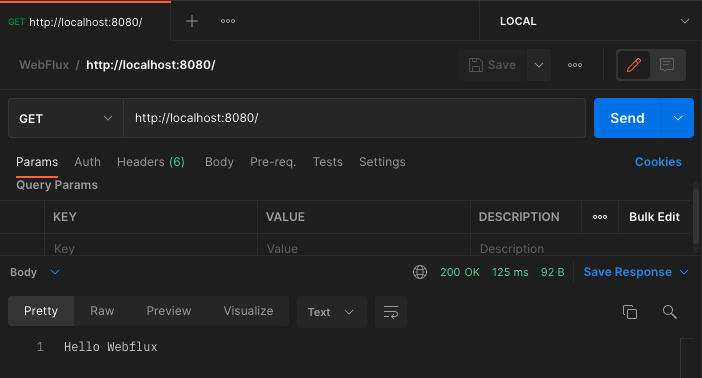

### Spring WebFlux Series - 16

[이전 장(링크)](https://imprint.tistory.com/245?category=1067652) 에서는 `WebFlux`에 대해서 간략하게 알아보았다.
이번 장에서는 이전 장에서 사용했던 `Mono`의 동작방식과 `block()` 에 대해서 자세하게 알아본다.
모든 코드는 [깃 허브 (링크)](https://github.com/roy-zz/webflux) 의 테스트 코드에 있으므로 필요하다면 참고하도록 한다.

---

static factory method

### Mono

#### 기본 사용법

`Mono`의 사용법을 알아보기 위해 간단한 컨트롤러를 작성해본다.
완성되어 있는 `Hello WebFlux`라는 문구를 반환하기 위해 Static Factory Method인 `just`를 사용하였다.

```java
@RestController
public class MyController {
    @GetMapping("/")
    public Mono<String> hello() {
        return Mono.just("Hello Webflux");
    }
}
```

컨트롤러가 작성되었으면 프로젝트를 실행시키고 포스트맨을 통해서 API를 요청해보면 우리가 원하는 결과가 반환되는 것을 확인할 수 있다.



---

### Mono로 감싸진 String의 의미

단순히 `String`을 반환하는 것과 `Mono`로 감싸진 `String`을 반환하는 것이 어떠한 차이가 있는지 알아본다.
기존에 작성된 컨트롤러 코드에 `log()`를 추가해본다.

```java
@RestController
public class MyController {
    @GetMapping("/log/v1")
    public Mono<String> logV1() {
        return Mono.just("Hello Webflux").log();
    }
}
```

우리는 이전에 `Publisher`와 `Subscriber`를 직접 구현하면서 아래의 구조와 같이 `Chaining`하는 방법에 대해서 알아보았다.
`Publisher - 1` -> `Publisher - 2` -> `Publisher - 3` -> `Subscriber`
위에서 작성한 컨트롤러의 `log()`는 `Publisher - 2`와 같은 위치에 존재한다고 보면 된다.

새로 작성한 컨트롤러를 포스트맨을 통해서 호출해보고 어떠한 로그가 출력되는지 확인해본다.

```bash
INFO 11264 --- [ctor-http-nio-3] reactor.Mono.Just.1     : | onSubscribe([Synchronous Fuseable] Operators.ScalarSubscription)
INFO 11264 --- [ctor-http-nio-3] reactor.Mono.Just.1     : | request(unbounded)
INFO 11264 --- [ctor-http-nio-3] reactor.Mono.Just.1     : | onNext(Hello Webflux)
INFO 11264 --- [ctor-http-nio-3] reactor.Mono.Just.1     : | onComplete()
```

결과를 확인해보면 `onSubscribe`가 호출되었다.
하지만 우리의 코드는 `onSubscribe`를 호출한 적이 없으며 스프링에서 우리 대신 호출한 것을 알 수 있다.

이번에는 `Mono.just(...).log()`의 결과를 반환하도록 코드를 수정하고 디버깅을 위해 `Mono`객체를 반환받는 곳 전후에 로그를 추가한다.

```java
@Slf4j
@RestController
public class MyController {
    @GetMapping("/log/v2")
    public Mono<String> logV2() {
        log.info("position 1");
        Mono<String> mono = Mono.just("Hello Webflux").log();
        log.info("position 2");
        return mono;
    }
}
```

포스트맨을 통해 새로 작성한 코드를 호출한 결과를 보면 아래와 같다.

```bash
INFO 11345 --- [ctor-http-nio-3] c.r.w.mono.controller.MyController: position 1
INFO 11345 --- [ctor-http-nio-3] c.r.w.mono.controller.MyController: position 2
INFO 11345 --- [ctor-http-nio-3] reactor.Mono.Just.1               : | onSubscribe([Synchronous Fuseable] Operators.ScalarSubscription)
INFO 11345 --- [ctor-http-nio-3] reactor.Mono.Just.1               : | request(unbounded)
INFO 11345 --- [ctor-http-nio-3] reactor.Mono.Just.1               : | onNext(Hello Webflux)
INFO 11345 --- [ctor-http-nio-3] reactor.Mono.Just.1               : | onComplete()
```

우리는 `position 1`이 출력 -> `Mono`객체 생성을 위한 과정 출력 -> `position 2 출력`과 같이 동작할 것으로 예상하였다.
하지만 `position 1`이후 `position 2`가 출력된 것을 확인할 수 있다.
`log()`라는 오퍼레이터에 의한 로그가 늦게 출력된 것은 큰 의미를 가진다.
실제로 `mono` 객체가 생성되는 시점이 아닌 사용되는 시점인 `return mono` 라인에서 `subscribe`가 호출되고 값이 채워진다.

`Mono`의 작동방식을 더 직관적으로 확인하기 위하여 아래와 같이 로그를 세분화 해본다.

```java
@Slf4j
@RestController
public class MyController {
    @GetMapping("/log/v3")
    public Mono<String> logV3() {
        log.info("position 1");
        String message = generateHello();
        Mono<String> mono = Mono.just(message).doOnNext(log::info).log();
        log.info("position 2");
        return mono;
    }
    private String generateHello() {
        log.info("Method generateHello()");
        return "Hello Mono";
    }
}
```

출력된 결과는 아래와 같으며 주의깊게 확인해야하는 부분은 `position 2`가 출력되기 이전에 `Method generateHello()`가 출력되었다는 점이다.
이전의 코드와는 다르게 `generateHello()`가 `Mono`의 `just` 내부에서 호출되는 것이 아니라 미리 호출된 값이 `Mono.just(...)`에 할당되기 때문에 `Method generateHello()`가 먼저 출력된 것을 알 수 있다.
이후의 동작은 기존과 동일하다.

```bash
INFO 11458 --- [ctor-http-nio-3] c.r.w.mono.controller.MyController       : position 1
INFO 11458 --- [ctor-http-nio-3] c.r.w.mono.controller.MyController       : Method generateHello()
INFO 11458 --- [ctor-http-nio-3] c.r.w.mono.controller.MyController       : position 2
INFO 11458 --- [ctor-http-nio-3] reactor.Mono.PeekFuseable.1              : | onSubscribe([Fuseable] FluxPeekFuseable.PeekFuseableSubscriber)
INFO 11458 --- [ctor-http-nio-3] reactor.Mono.PeekFuseable.1              : | request(unbounded)
INFO 11458 --- [ctor-http-nio-3] c.r.w.mono.controller.MyController       : Hello Mono
INFO 11458 --- [ctor-http-nio-3] reactor.Mono.PeekFuseable.1              : | onNext(Hello Mono)
INFO 11458 --- [ctor-http-nio-3] reactor.Mono.PeekFuseable.1              : | onComplete()
```

기존과 동일하게 값이 `subscribe`되는 시점에 `generateHello` 메서드를 호출을 지연하고 싶다면 `just`대신 `fromSupplier`를 사용하여 람다식을 전달해야한다.
`Supplier`는 파라미터는 없고 리턴 값만 존재하는 형태를 의미한다. 람다식을 전달하는 것은 바로 실행시키는 것이기 아니기 때문에 우리가 원하는대로 작동하게 된다.

```java
@Slf4j
@RestController
public class MyController {
    @GetMapping("/log/v4")
    public Mono<String> logV4() {
        log.info("position 1");
        Mono<String> mono = Mono.fromSupplier(this::generateHello).doOnNext(log::info).log();
        log.info("position 2");
        return mono;
    }
    private String generateHello() {
        log.info("Method generateHello()");
        return "Hello Mono";
    }
}
```

API를 호출하고 출력되는 결과는 아래와 같이 `subscribe`되는 시점에 `generateHello` 메서드가 호출된 것을 알 수 있다.

```bash
INFO 11558 --- [ctor-http-nio-3] c.r.w.mono.controller.MyController       : position 1
INFO 11558 --- [ctor-http-nio-3] c.r.w.mono.controller.MyController       : position 2
INFO 11558 --- [ctor-http-nio-3] reactor.Mono.PeekFuseable.1              : | onSubscribe([Fuseable] FluxPeekFuseable.PeekFuseableSubscriber)
INFO 11558 --- [ctor-http-nio-3] reactor.Mono.PeekFuseable.1              : | request(unbounded)
INFO 11558 --- [ctor-http-nio-3] c.r.w.mono.controller.MyController       : Method generateHello()
INFO 11558 --- [ctor-http-nio-3] c.r.w.mono.controller.MyController       : Hello Mono
INFO 11558 --- [ctor-http-nio-3] reactor.Mono.PeekFuseable.1              : | onNext(Hello Mono)
INFO 11558 --- [ctor-http-nio-3] reactor.Mono.PeekFuseable.1              : | onComplete()
```

만약 개발자 의도적으로 `Subcribe`를 두 번 호출하면 어떻게 되는지 확인해본다.
아래의 코드는 `mono.subscribe()`에서 `subscribe`가 한 번 호출되고 `return mono`에서 `subscribe`가 한 번 호출되어 총 두 번 호출된다.

```java
@Slf4j
@RestController
public class MyController {
    @GetMapping("/log/v6")
    public Mono<String> logV6() {
        log.info("position 1");
        Mono<String> mono = Mono.fromSupplier(this::generateHello).doOnNext(log::info).log();
        mono.subscribe();
        log.info("position 2");
        return mono;
    }
    private String generateHello() {
        log.info("Method generateHello()");
        return "Hello Mono";
    }
}
```

결과는 동일한 로직이 두 번 실행되어 `generateHello` 메서드가 두 번 호출된다. 출력은 아래와 같다.

```bash
INFO 11642 --- [ctor-http-nio-3] c.r.w.mono.controller.MyController       : position 1
INFO 11642 --- [ctor-http-nio-3] reactor.Mono.PeekFuseable.1              : | onSubscribe([Fuseable] FluxPeekFuseable.PeekFuseableSubscriber)
INFO 11642 --- [ctor-http-nio-3] reactor.Mono.PeekFuseable.1              : | request(unbounded)
INFO 11642 --- [ctor-http-nio-3] c.r.w.mono.controller.MyController       : Method generateHello()
INFO 11642 --- [ctor-http-nio-3] c.r.w.mono.controller.MyController       : Hello Mono
INFO 11642 --- [ctor-http-nio-3] reactor.Mono.PeekFuseable.1              : | onNext(Hello Mono)
INFO 11642 --- [ctor-http-nio-3] reactor.Mono.PeekFuseable.1              : | onComplete()
INFO 11642 --- [ctor-http-nio-3] c.r.w.mono.controller.MyController       : position 2
INFO 11642 --- [ctor-http-nio-3] reactor.Mono.PeekFuseable.1              : | onSubscribe([Fuseable] FluxPeekFuseable.PeekFuseableSubscriber)
INFO 11642 --- [ctor-http-nio-3] reactor.Mono.PeekFuseable.1              : | request(unbounded)
INFO 11642 --- [ctor-http-nio-3] c.r.w.mono.controller.MyController       : Method generateHello()
INFO 11642 --- [ctor-http-nio-3] c.r.w.mono.controller.MyController       : Hello Mono
INFO 11642 --- [ctor-http-nio-3] reactor.Mono.PeekFuseable.1              : | onNext(Hello Mono)
INFO 11642 --- [ctor-http-nio-3] reactor.Mono.PeekFuseable.1              : | onComplete()
```

`Mono`나 `Flux` 같은 `Publisher`들은 하나 이상의 `Subscriber`를 가질 수 있다.
`Publishing`하는 소스는 `Cold` 타입과 `Hot` 타입 두 가지가 있다.
우리가 작성한 코드와 같이 어떠한 `Subscriber`가 데이터를 요청하더라도 항상 같은 결과가 제공된다면 `Cold` 타입이라고 한다.
`Cold` 타입의 소스인 경우 `Subscribe`가 일어날 때 마다 데이터를 처음부터 전부 전달한다.
실시간으로 발생하는 라이브정보와 같은 데이터는 `Hot` 타입이라고 하며 새로운 `Subscribe`가 발생했을 때 `Subscribe`한 시점부터의 데이터만 받아온다.

---

### Block

만약 `Mono`로 `String`을 감싼 형태가 아니라 `String`을 바로 사용하고 싶은 경우라면 `block()` 메서드를 사용하면 된다.

```java
@Slf4j
@RestController
public class MyController {
    @GetMapping("/log/v7")
    public Mono<String> logV7() {
        log.info("position 1");
        Mono<String> mono = Mono.just(generateHello()).doOnNext(log::info).log();
        String message = mono.block();
        log.info("position 2: " + message);
        return mono;
    }
    private String generateHello() {
        log.info("Method generateHello()");
        return "Hello Mono";
    }
}
```

아... 강의에서는 정상적으로 작동하였지만 필자의 경우 `block`, `blockFirst`, `blockLast` 메서드는 `reactor-http-nio-3` 스레드를 지원하지 않는다는 오류가 발생하였다.
아마 스프링 버전에 따라서 문제가 발생하는 듯 하다. 이 부분은 추후에 해결방법을 찾아서 다시 올리도록 한다.

```bash
java.lang.IllegalStateException: block()/blockFirst()/blockLast() are blocking, which is not supported in thread reactor-http-nio-3
	at reactor.core.publisher.BlockingSingleSubscriber.blockingGet(BlockingSingleSubscriber.java:83) ~[reactor-core-3.4.17.jar:3.4.17]
	Suppressed: reactor.core.publisher.FluxOnAssembly$OnAssemblyException: 
```

정상 작동하였다면 `block`메서드를 호출하는 시점에 `subscribe`를 한 번 호출하고 `String`타입을 반환한 뒤 다음으로 코드가 넘어갔어야한다.
`get`, `exec`와 같은 사용법이 아닌 `block`인 이유는 `mono.block()`를 호출하는 시점에 코드는 더 이상 진행되지 않고 결과를 가져올 때 까지 블록킹되기 때문이다.
블록킹을 해야지만 데이터를 가져올 수 있고 메서드명 또한 `block`으로 만들어졌다. 

가능하다면 `block`과 같은 메서드를 사용하지 않고 `Mono`를 통해서 데이터를 전달하는 습관을 가지는 것이 좋다.

---

### 참고

- `build.gradle`에서 `Lombok` 라이브러리가 아래와 같이 `compileOnly`가 사용되는 이유는 `compile`하는 시점에서 한 번만 작동하기 때문이다.

```bash
compileOnly 'org.projectlombok:lombok'
```

- `Netty`를 사용하는 경우 `Tomcat`을 사용할 때 보다 실행속도가 빠르다.  
  `Netty`의 경우 가벼운 서버이며 서블릿을 위에서 동작하기 위한 부가적인 동작들이 전부 생략되기 때문에 `WebFlux`코드는 상당히 빠르게 실행된다.

- `String` 타입을 반환하면 기본적으로 Content-Type이 `text/plain`이 된다.  
  만약 `Object`가 들어가면 `application/json`이 선택되며 이외는 직접 `Content-Type`을 지정해주어야 한다.

- 예제에서는 아래와 같이 `Supplier`를 사용하고 있다.
  `Mono<String> mono = Mono.fromSupplier(this::generateHello).doOnNext(log::info).log();`
  만약 이러한 사용법이 익숙하지 않다면 `Supplier` 부분을 아래와 같이 익명 클래스로 생성하여 사용하는 것과 같은 방법이라고 생각하면 된다.

```java
@GetMapping("/log/v5")
public Mono<String> logV5() {
    log.info("position 1");
    Mono<String> mono = Mono.fromSupplier(new Supplier<String>() {
                @Override
                public String get() {
                    return generateHello();
                }
            }).doOnNext(log::info).log();
    log.info("position 2");
    return mono;
}
```

- 여러개의 `Operator`가 사용되는 경우 성능 향상을 위하여 `Operator Fusion`이라는 기능을 사용할 수 있다.

- `Mono`를 통해서 데이터를 전달하는 코드를 작성하고 실제로 `subscribe`하는 코드를 작성하지 않으면 작성한 코드가 하나도 작동하지 않을 수 있다.
  결국 코드는 조합되어있는 것이지 실행되는 것은 아니기 때문이다.

- `Mono`와 `Flux`는 마블 다이어그램이라 불리며 데이터가 **상류에서 하류(Downstream)** 로 흐르는 것처럼 작동한다.

---

**참고한 강의**

- https://www.youtube.com/watch?v=LK6NRV8tZBM&ab_channel=TobyLee