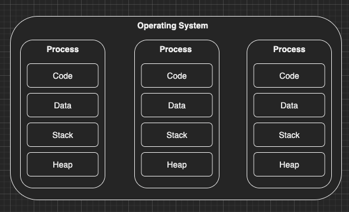
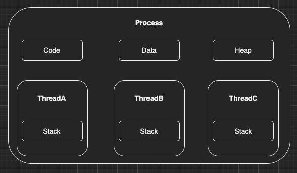

이번 장부터 자바의 Concurrency Utilities에 대해서 알아본다.
예시에서 사용되는 모든 코드는 [깃허브 (링크)](https://github.com/roy-zz/webflux)의 테스트 코드로 첨부하였으므로 필요한 경우 참고하도록 한다.

### Process & Thread

#### Program
> 컴퓨터에서 실행될 때 특정 작업(specific task)을 수행하는 일련의 명령어들의 모음(집합)이다.

위키백과

Process를 실행시키기 위해 준비되어 있는 설치파일이다.

#### Process
> 프로세스는 컴퓨터에서 실행되는 프로그램을 말한다.

위키백과

- PC를 켜고 카카오톡을 설치하면 프로그램이 설치된 것이며 실행하면 카카오톡에게 메모리가 할당되며 프로세스가 실행되는 것이다.
- OS로부터 메모리 뿐만 아니라 필요한 자원을 할당받는다.
- 할당 받는 자원은 아래와 같다.
    - CPU 사용 시간
    - Memory
    - Code (프로그램의 명령어(코드)를 구성하는 메모리 영역)
    - Data (전역 변수, 정적 변수, 배열 등 초기화된 데이터)
    - Stack (지역 변수, 매개 변수 리턴 값)
    - Heap (동적으로 할당되는 메모리 사용)
  

프로세스는 기본적으로 프로그램을 실행시키기 위한 메인 스레드를 가지고 있다.
할당된 Code, Data, Stack, Heap은 프로세스간에 공유되지 않는다.
기본적으로 각 프로세스는 별도의 주소 공간에서 실행되므로 하나의 프로세스는 다른 프로세스의 영역에 접근이 불가능하다.
~~(물론 IPC(Inter Process Communication)을 사용하면 가능하다)~~

#### Thread
> 스레드는 어떠한 프로그램 내에서, 특히 프로세스 내에서 실행되는 흐름의 단위를 말한다.

위키백과

- 카카오톡을 실행하면 메시지를 수신하는 Thread는 계속 메시지를 수신하고 있을 것이며 광고를 보여주는 Thread는 지속적으로 클라이언트에게 광고를 보여줄 것이다.
  이처럼 각 Thread는 Process 내부에서 자신이 담당하는 업무를 진행할 것이다.

기본적으로 Process가 실행되면 Main Thread하나가 실행되며 개발자가 의도적으로 Thread를 생성하지 않으면 Program의 코드는 Main Thread에서 실행된다.
여러 Thread가 생성되면 Process내에서 Stack을 제외한 Code, Data, Heap영역을 공유한다.

Thread에서 메서드를 호출하면 Call Stack이 쌓이게 된다. 
만약 Thread별로 Stack이 공유된다면 Call Stack이 공유되는 현상이 발생하게 된다.
[JVM의 Stack & Frame(링크)](https://imprint.tistory.com/104?category=1003394)에 Stack과 Frame에 대해서 자세하게 정리해 두었으므로 필요하면 확인해보도록 한다.
JVM의 메모리 구조 또한 이러한 구조를 따라간다. JVM의 메모리 구조에 대한 정보가 필요하다면 필자가 정리해 둔 [자료(링크)](https://imprint.tistory.com/34?category=1003394)를 확인하도록 한다.

#### Process vs Thread

Process와 Thread를 한 번에 비교할 수 있는 좋은 표가 있어서 첨부한다.

|   | Process | Thread |
| 1 | 프로세스는 모든 프로그램이 실행 중임을 의미한다. | 스레드는 프로세스의 한 부분을 의미한다. |
| 2 | 프로세스의 생성과 종료는 더 많은 시간이 소요된다. | 스레드의 생성과 종료는 상대적으로 적은 시간이 소요된다. |
| 3 | Context Switching에 많은 시간이 소요된다. | Context Switching에 상대적으로 적은 시간이 소요된다. |
| 4 | 프로세스간 커뮤니케이션은 복잡하다. | 스레드간 커뮤니케이션은 상대적으로 단순하다. |
| 5 | 다중 프로그래밍은 다중 프로세서의 개념을 포함한다. | 단일 프로세스가 여러 스레드로 구성되어 있기 때문에 여러 스레드에 대해 작동 중인 여러 프로그램이 필요하지 않다. |
| 6 | 프로세스는 서로 격리된다. | 스레드는 서로 메모리를 공유한다. |
| 7 | 프로세스는 Heavy Weight 프로세스라고 불린다. | 스레드는 프로세스의 각 코드, 데이터, 리소스를 공유하므로 가볍다. |
| 8 | 프로세스 전환은 OS의 인터페이스를 사용한다. | 스레드 전환은 운영 체제를 호출할 필요가 없으며 커널에 인터럽트를 발생시킨다. |
| 9 | 한 프로세스가 차단되면 다른 프로세스의 실행에 영향을 미치지 않는다. | 사용자 수준의 스레드가 차단되면 다른 모든 사용자 수준의 스레드도 차단된다. |
| 10 | 프로세스에는 자체 프로세스 제어 블록, 스택 및 주소 공간이 있다. | 스레드는 부모의 PCB, 자체 스레드 제어 블록, 스택 및 공통 주소 공간을 가지고 있다. |
| 11 | 상위 프로세스에 대한 변경 사항은 하위 프로세스에 영항을 미치지 않는다. | 동일한 프로세스의 모든 스레드는 주소 공간 및 리소스를 공유하므로 메인 스레드가 변경되면 다른 스레드에도 영향이 미칠 수 있다.|

---

### Multi Processing(다중 처리)
> 다중 처리는 컴퓨터 시스템 한 대에 둘 이상의 중앙 처리 장치(CPU)를 이용하여 병렬로 처리하는 것을 가리킨다.
> 또 이 용어는 하나 이상의 프로세서를 지원하는 시스템의 능력, 또는 이들 사이의 태스크를 할당하는 능력을 가리키기도 한다.
> 다중 처리 시스템(Multiprocessing System)은 다중 처리가 적용된 시스템을 뜻한다.
> 다중 처리 시스템에서는 여러 개의 프로세서가 하나의 메모리를 공유하여 사용하는 시스템이며, 일반적으로 하나의 운영 체제가 모든 프로세서들을 제어한다.

위키백과

동일한 프로그램을 사용하여 다중 프로세스를 실행시키는 것을 의미한다.

**장점**:
같은 역할을 하는 프로세스가 다중으로 존재하므로 안정성이 올라간다.

**단점**:
Context Switching이 발생할 때 캐쉬 메모리 초기화 등 무거운 작업이 진행되므로 오버헤드가 발생한다.
프로세스 간에 독립된 메모리 영역을 할당받기 때문에 Context Switching이 발생하면 캐쉬의 모든 데이터를 리셋해야한다.
프로세스 간의 통신을 위해서는 복잡한 통신 기법을 사용해야한다.

**번외**:
K8S를 활용하여 동일한 서비스(프로세스)를 여러개 실행시키는 상황을 생각해보았다.
위키백과의 정의에 따르면 Multi Processing은 컴퓨터 시스템 "한 대에 둘 이상의 중앙 처리장치"를 사용해야한다고 정의하고 있다.
또한 여러 개의 프로세서가 하나의 메모리를 공유하는 시스템이라고 정의하고 있다.
K8S를 통해 여러 인스턴스(Computing Machine)에 동일한 서비스를 복제본(Replica)을 만들어 여러 서비스를 실행시키는 것은 Multi Processing이라고 볼 수 없다.

---

### Multi Threading
> 멀티스레딩(multithreading) 컴퓨터는 여러 개의 스레드를 효과적으로 실행할 수 있는 하드웨어 지원을 갖추고 있다.
> 이는 스레드가 모두 같은 주소 공간에서 동작하여 하나의 CPU 캐시 공유 집합과 하나의 변환 색인 버퍼(TLB)만 있는 믈티프로세서 시스템(멀티 코어 시스템)과는 구별한다.
> 그러므로 멀티스레딩은 프로그램 안에서 병렬 처리의 이점을 맛볼 수 있지만 멀티프로세싱 시스템은 여러 개의 프로그램들을 병렬로 처리할 수 있다.

위키백과

**장점**:
1. 응답성: 프로그램의 일부분(스레드)이 중단되거나 긴 작업을 수행하더라도 프로세스의 수행이 계속되어 사용자에 대한 응답성이 증가된다.
         예를 들어 Spring MVC는 HTTP Request를 스레드 풀의 스레드를 사용하여 처리하는데 처리시간이 긴 요청이 들어오더라도 다른 요청들은 영향을 받지 않고 처리가 가능하다.
         (물론 처리시간이 긴 요청들이 모든 스레드를 점유하고 있다면 영향을 받을 수 있다.)

2. 자원 공유: 스레드는 자동적으로 그들이 속한 프로세스의 자원들과 메모리를 공유한다. 코드 공유의 이점은 한 응용 프로그램이 같은 주소 공간 내의 여러 개의 다른 활동성 스레드를 가질 수 잇다는 점이다.

3. 경제성: 프로세스 생성에 메모리와 자원을 할당하는 것은 비용이 많이든다. 하지만 스레드는 자신이 속한 프로세스의 자원들을 공유하기 때문에 스레드를 생성하거나 Context Switching에 대한 비용이 저렴하다.

4. 멀티프로세서(멀티코어) 활용: 멀티프로세서(멀티코어) 구조에서 각각의 스레드가 다른 프로세서에서 병렬로 수행될 수 있다. 
                         단일 스레드의 경우 CPU의 코어가 많더라도 한 개의 코어만 사용이 가능하지만 다중 스레드의 경우 멀티 코어를 효율적으로 사용할 수 있다.

**단점**: 
1. 다중 스레드는 캐시나 변환 색인 버퍼와 같은 리소스를 공유할 때 서로를 간섭할 수 있으므로 Thread-Safe한 설계가 필요하다.
2. 단일프로세스(하나의 코어)에서는 성능 상승 효과를 기대하기 어렵다.
3. 스레드가 각각 병렬로 작동하기 때문에 프로그램의 디버깅이 어려워진다.

---

### 정리

지금까지 우리는 Process와 Thread의 차이와 Multi Processing, Multi Threading에 대해서 알아보았다.
최신 운영 체제는 이러한 프로세스와 스레드를 통해 동시성을 지원하고 있다.

자바에서는 이러한 여러 스레드가 동시에 작동하는 환경에서의 문제(서로의 리소스를 간섭 등)를 방지하기 위한 자료구조인 ConcurrencyUtils를 제공하고 있다.
스레드와 멀티스레딩에 대한 개념은 공부하였으니 다음 장부터는 자바에서 어떻게 Thread-Safe하게 개발을 할 수 있는지 확인해본다.

---

**참고 자료**

- https://winterbe.com/posts/2015/04/07/java8-concurrency-tutorial-thread-executor-examples/
- https://www.geeksforgeeks.org/difference-between-process-and-thread/
- https://gmlwjd9405.github.io/2018/09/14/process-vs-thread.html
- https://brunch.co.kr/@kd4/3
- https://magi82.github.io/process-thread/
- https://colinder.github.io/processvsthread/