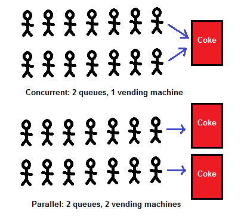
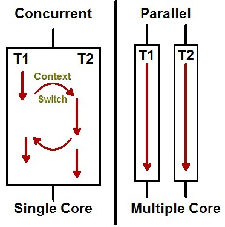

이번 장부터 자바의 Concurrency Utilities에 대해서 알아보기 전에 Concurrency(동시성)에 대해서 짧게 알아보도록 한다.
예시에서 사용되는 모든 코드는 [깃허브 (링크)](https://github.com/roy-zz/webflux)의 테스트 코드로 첨부하였으므로 필요한 경우 참고하도록 한다.

---

### Concurrency(동시성) vs Parallelism(병렬성)

우리는 한 번에 여러가지 일을 처리하는데 동시에 처리가 된다면 Concurrent한 프로그램이라고 얘기한다.
이것은 하드웨어 관점에서 바라본 것이 아니라 프로그램을 논리적으로 바라봤기 때문이다.
실제로 프로그램이 작동하는 방식을 보면 우리가 원하는 것처럼 병렬로 동시에 작업이 진행되는 것은 아니지만 병렬로 진행되는 것 처럼 느껴지는 것일 수 있다.

그림을 살펴보면 위의 상황은 하나의 자판기에서 두 줄의 사람이 동시에 사용하는 상황이다.
일(고객의 주문)을 처리할 수 있는 자판기는 하나지만 처리해야하는 일(고객의 줄)은 두 개인 상황이다.
이러한 상황에서 두 줄에서 번갈아가면서 한 명씩 주문을 한다면 자판기는 하나지만 두 개의 일을 동시에 처리할 수 있다.
이러한 성질을 Concurrency(동시성)이라고 한다.

하지만 한 줄의 일을 처리할 때 나머지 한 줄의 요청에 대한 처리는 뒤로 밀리게 된다.
즉, 동시에 병렬로 처리할 수는 없는 것이며 Parallel하다고 할 수는 없다.

이에 반해 아래의 상황은 두 개의 자판기에서 두 개의 줄을 처리하고 있다.
서로 영항을 받지 않으며 각각의 자판기는 다른 일의 영향을 받지않고 자신의 일을 처리하면 된다. 이러한 성질을 Parallelism(병렬성)이라 한다.

---

그렇다면 왜 병렬적으로 진행되지 않는데 우리가 느끼기에는 병렬적으로 진행되는 것 같은지는 아래의 이미지를 보면 이해하기가 쉽다.

멀티 스레딩 환경에서 사용가능한 코어가 하나밖에 없는 상황이라 하더라도 CPU는 처리 중간에 지속적으로 Context Switching을 진행한다.
여러 스레드의 작업을 중간중간 Context Switching하면서 진행하기 때문에 우리는 병렬로 진행된고 있다고 느끼는 것이다.

---

### 데이터 병렬성 vs 작업 병렬성

**데이터 병렬성**: 같은 작업을 병렬로 처리하는 것을 의미한다.
예를 들어 A, B, C로 파티셔닝 되어있는 DB에서 데이터를 조회할 때 어떤 스레드는 A에서 찾고 어떤 스레드는 B에서 찾고 어떤 스레드는 C에서 찾는다면 이것은 데이터 병렬성이라고 볼 수 있다.
자바 8에 추가된 병렬 스트림이 대표적으로 데이터 병렬성을 구현한 것이라고 볼 수 있다.

**작업 병렬성**: 서로 다른 작업을 병렬로 처리하는 것을 의미한다.
Tomcat의 경우 고객의 요청이 들어왔을 때 스레드 풀에서 스레드를 가져와서 요청을 처리한다.
처리 중에 다른 요청이 들어오면 다시 스레드 풀에서 스레드를 가져와서 병렬로 처리한다. 고객의 요청은 전혀 관련이 없지만 Tomcat은 이를 병렬로 처리한다.
이러한 성질을 작업 병렬성이라고 할 수 있다.

---

**참고 자료**

- https://jenkov.com/tutorials/java-util-concurrent/blockingqueue.html